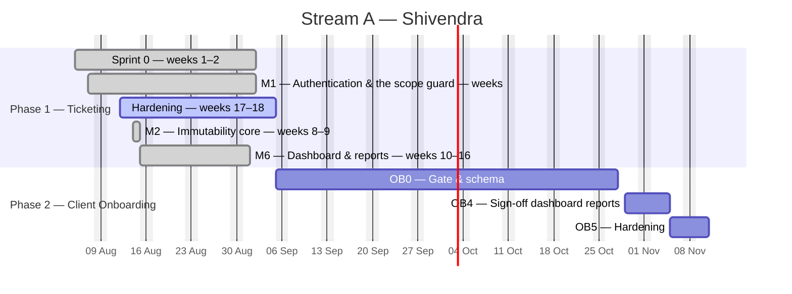
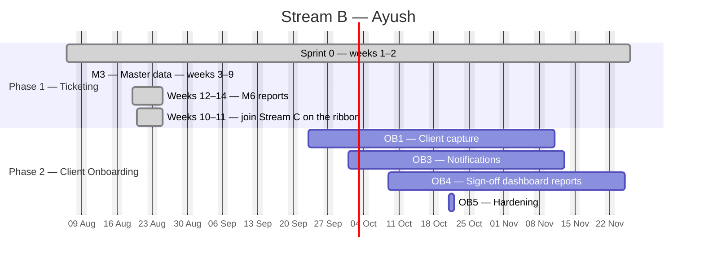
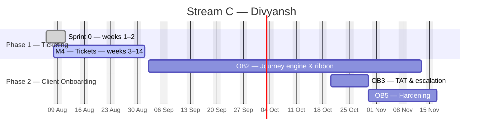
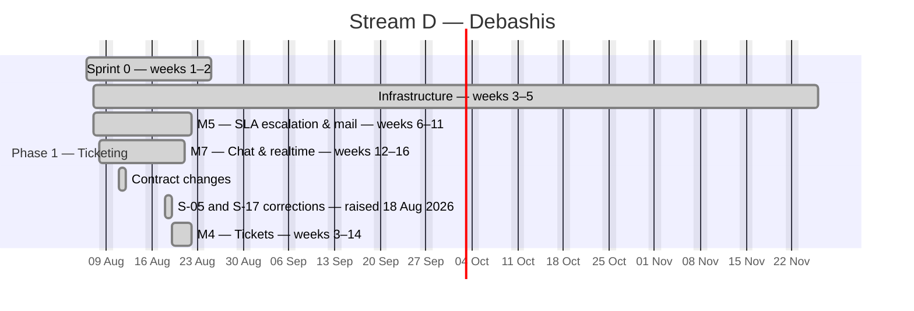

# EduTrack — Master Schedule

**Generated Tue 01 Sep 2026 · day 21 of the plan · finish forecast Tue 24 Nov**

> Regenerated automatically at 09:00 every working day by `tools/plan/schedule.py`. **Do not hand-edit.** Change an estimate or a dependency in [`tasks.csv`](tasks.csv); record a status git cannot see in [`overrides.json`](overrides.json).

Interactive chart: [`gantt.html`](gantt.html) · Today's briefs: [`standup/2026-09-01.md`](standup/2026-09-01.md)

---

## Where we are

Each phase is counted on its own. A phase's *working days available* is the span of that phase alone, so a finished phase does not flatter the load of the one running now, and a new phase does not make a finished one look incomplete.

### Phase 1 — Ticketing

*Wed 05 Aug → Fri 04 Sep*

| | Tasks | Effort (days) |
|---|---:|---:|
| Complete | 241 of 244 (99%) | 360.8 of 365.8 (99%) |
| In flight | 0 | 0.0 |
| On the driving chain | 2 | 4.0 |
| Zero float (no slack at all) | 2 | 4.0 |

| Stream | Developer | Tasks | Done | Effort | Working days available | Load | Finishes |
|---|---|---:|---:|---:|---:|---:|---|
| **A** | Shivendra | 65 | 63 | 95.0 | 23 | 413% ⚠️ | Fri 04 Sep |
| **B** | Ayush | 55 | 55 | 89.8 | 23 | 390% ⚠️ | Sat 22 Aug |
| **C** | Divyansh | 59 | 58 | 90.0 | 23 | 391% ⚠️ | Tue 01 Sep |
| **D** | Debashis | 65 | 65 | 91.0 | 23 | 396% ⚠️ | Sat 22 Aug |

### Phase 2 — Client Onboarding

*Wed 02 Sep → Tue 24 Nov*

| | Tasks | Effort (days) |
|---|---:|---:|
| Complete | 0 of 63 (0%) | 0.0 of 132.0 (0%) |
| In flight | 0 | 0.0 |
| On the driving chain | 31 | 57.0 |
| Zero float (no slack at all) | 31 | 57.0 |

| Stream | Developer | Tasks | Done | Effort | Working days available | Load | Finishes |
|---|---|---:|---:|---:|---:|---:|---|
| **A** | Shivendra | 23 | 0 | 47.0 | 60 | 78% | Tue 10 Nov |
| **B** | Ayush | 23 | 0 | 41.0 | 60 | 68% | Tue 24 Nov |
| **C** | Divyansh | 17 | 0 | 44.0 | 60 | 73% | Sat 14 Nov |

### Whole plan

| | Tasks | Effort (days) |
|---|---:|---:|
| Complete | 241 of 307 (79%) | 360.8 of 497.8 (72%) |
| In flight | 0 | 0.0 |
| On the driving chain | 33 | 61.0 |
| Zero float (no slack at all) | 33 | 61.0 |

| Stream | Developer | Tasks | Done | Effort | Working days available | Load | Finishes |
|---|---|---:|---:|---:|---:|---:|---|
| **A** | Shivendra | 88 | 63 | 142.0 | 81 | 175% ⚠️ | Tue 10 Nov |
| **B** | Ayush | 78 | 55 | 130.8 | 81 | 161% ⚠️ | Tue 24 Nov |
| **C** | Divyansh | 76 | 58 | 134.0 | 81 | 165% ⚠️ | Sat 14 Nov |
| **D** | Debashis | 65 | 65 | 91.0 | 81 | 112% ⚠️ | Sat 22 Aug |

### Slipping

| Task | Owner | Baseline end | Forecast end | Slip |
|---|---|---|---|---:|
| `A-023` Opaque refresh token, 7 days, HttpOnly + Secure  | Shivendra | Fri 14 Aug | Mon 10 Aug | +73d |
| `A-025` Logout | Shivendra | Tue 18 Aug | Mon 10 Aug | +71d |
| `A-026` Forced password change on first login — must_cha | Shivendra | Wed 19 Aug | Mon 10 Aug | +70d |
| `B-007` Ticket fixture corpus | Ayush | Wed 19 Aug | Mon 10 Aug | +70d |
| `A-027` Forgot/reset password — single-use, 30-min TTL,  | Shivendra | Thu 20 Aug | Mon 10 Aug | +69d |
| `C-011` Ticket ID generation | Divyansh | Thu 20 Aug | Mon 10 Aug | +69d |
| `B-006` MapStruct base configuration | Ayush | Fri 21 Aug | Mon 10 Aug | +68d |
| `B-031` Step 1 — template download | Ayush | Tue 25 Aug | Mon 17 Aug | +67d |
| `C-010` Create ticket — all field groups from blueprint  | Divyansh | Tue 25 Aug | Mon 10 Aug | +66d |
| `B-032` Step 2 — upload, max 5 MB / 5,000 rows, event-dr | Ayush | Thu 27 Aug | Mon 17 Aug | +65d |
| `C-013` Actions: Save & Assign · Save as Draft · Save &  | Divyansh | Wed 26 Aug | Mon 10 Aug | +65d |
| `B-034` Step 4 — dry-run validation preview | Ayush | Wed 02 Sep | Mon 17 Aug | +61d |
| `C-015` Saved views | Divyansh | Tue 01 Sep | Mon 10 Aug | +61d |
| `C-016` Row colour cues | Divyansh | Wed 02 Sep | Mon 10 Aug | +60d |
| `B-035` Step 5 — commit as a background job with progres | Ayush | Fri 04 Sep | Mon 17 Aug | +59d |
| `A-052` /tickets/{id}/full aggregated endpoint | Shivendra | Fri 18 Sep | Sun 16 Aug | +58d |
| `C-028` Delete within 15 minutes by the uploader; after  | Divyansh | Fri 18 Sep | Sun 16 Aug | +58d |
| `A-053` Cursor pagination + virtualised grid rendering b | Shivendra | Tue 29 Sep | Sun 16 Aug | +51d |
| `C-030` @mention type-ahead over project members, firing | Divyansh | Wed 23 Sep | Mon 17 Aug | +46d |
| `D-013` Channel interceptor authorising subscriptions wi | Debashis | Tue 22 Sep | Mon 10 Aug | +46d |

*…and 99 more — see the interactive chart.*

---

## The chain that sets the finish date

Each of these is held up either by the one before it or by the fact that the same person has to do both. Shorten this chain and go-live moves; shorten anything else and it does not.

| # | Task | Owner | Title | Est | Start | End | Held up by |
|---:|---|---|---|---:|---|---|---|
| 1 | `A-052` | Shivendra | /tickets/{id}/full aggregated endpoint | 1 | Sun 16 Aug | Sun 16 Aug | — |
| 2 | `A-053` | Shivendra | Cursor pagination + virtualised grid rendering beyon | 1.5 | Sun 16 Aug | Sun 16 Aug | `A-052` finished |
| 3 | `A-073` | Shivendra | Performance | 2 | Tue 01 Sep | Wed 02 Sep | `A-053` finished |
| 4 | `A-075` | Shivendra | Go-live runbook, deployment, TLS, secrets in vault | 2 | Thu 03 Sep | Fri 04 Sep | `A-073` finished |
| 5 | `A-118` | Shivendra | OpenAPI contract for the whole module | 3 | Sat 05 Sep | Wed 09 Sep | Shivendra was busy on `A-075` |
| 6 | `A-119` | Shivendra | Wire-conformance ratchet for onboarding DTOs | 2 | Thu 10 Sep | Fri 11 Sep | `A-118` finished |
| 7 | `A-101` | Shivendra | Client capture tables | 2 | Sat 12 Sep | Tue 15 Sep | Shivendra was busy on `A-119` |
| 8 | `A-102` | Shivendra | ob_payments and ob_attachments | 1 | Wed 16 Sep | Wed 16 Sep | `A-101` finished |
| 9 | `A-103` | Shivendra | Journey template tables | 2 | Thu 17 Sep | Fri 18 Sep | Shivendra was busy on `A-102` |
| 10 | `A-104` | Shivendra | Journey instance tables | 2 | Sat 19 Sep | Tue 22 Sep | `A-103` finished |
| 11 | `A-106` | Shivendra | Append-only pair, hash-chained | 3 | Wed 23 Sep | Fri 25 Sep | `A-104` finished |
| 12 | `A-105` | Shivendra | ob_step_clock_events | 1 | Sat 26 Sep | Sat 26 Sep | Shivendra was busy on `A-106` |
| 13 | `A-107` | Shivendra | Sign-off, outbox and escalation tables | 2 | Tue 29 Sep | Wed 30 Sep | Shivendra was busy on `A-105` |
| 14 | `B-110` | Ayush | Outbox dispatcher with retry | 2 | Thu 01 Oct | Fri 02 Oct | `A-107` finished |
| 15 | `B-111` | Ayush | Email templates through the existing mail engine — n | 1 | Sat 03 Oct | Sat 03 Oct | `B-110` finished |
| 16 | `B-112` | Ayush | OB-13 | 2 | Tue 06 Oct | Wed 07 Oct | Ayush was busy on `B-111` |
| 17 | `B-114` | Ayush | Daily digest to managers | 1 | Thu 08 Oct | Thu 08 Oct | `B-112` finished |
| 18 | `B-120` | Ayush | ob_dashboard_summary refresh job | 2 | Fri 09 Oct | Sat 10 Oct | Ayush was busy on `B-114` |
| 19 | `B-121` | Ayush | OB-02 | 3 | Tue 13 Oct | Thu 15 Oct | `B-120` finished |
| 20 | `B-122` | Ayush | OB-10 | 3 | Fri 16 Oct | Tue 20 Oct | Ayush was busy on `B-121` |
| 21 | `B-123` | Ayush | Export redaction | 1 | Wed 21 Oct | Wed 21 Oct | `B-122` finished |
| 22 | `B-102` | Ayush | Client CRUD and the duplicate guard | 3 | Thu 22 Oct | Sat 24 Oct | Ayush was busy on `B-123` |
| 23 | `B-103` | Ayush | SPOC contacts — multiple per client, one primary | 1 | Tue 27 Oct | Tue 27 Oct | `B-102` finished |
| 24 | `B-104` | Ayush | Applications purchased — with license start and end  | 1 | Wed 28 Oct | Wed 28 Oct | Ayush was busy on `B-103` |
| 25 | `B-105` | Ayush | Payment schedule | 2 | Thu 29 Oct | Fri 30 Oct | Ayush was busy on `B-104` |
| 26 | `B-106` | Ayush | Requirements | 1 | Sat 31 Oct | Sat 31 Oct | Ayush was busy on `B-105` |
| 27 | `B-107` | Ayush | Client attachments — the existing upload pipeline, u | 1 | Tue 03 Nov | Tue 03 Nov | Ayush was busy on `B-106` |
| 28 | `B-108` | Ayush | OB-03 — client list — filter by status, RAG, owner a | 2 | Wed 04 Nov | Thu 05 Nov | Ayush was busy on `B-107` |
| 29 | `B-109` | Ayush | OB-04 | 3 | Fri 06 Nov | Tue 10 Nov | Ayush was busy on `B-108` |
| 30 | `B-113` | Ayush | OB-11 and OB-12 | 2 | Wed 11 Nov | Thu 12 Nov | Ayush was busy on `B-109` |
| 31 | `B-115` | Ayush | OB-09 | 2 | Fri 13 Nov | Sat 14 Nov | Ayush was busy on `B-113` |
| 32 | `B-117` | Ayush | The objection path | 1 | Tue 17 Nov | Tue 17 Nov | `B-115` finished |
| 33 | `B-116` | Ayush | Acceptance PDF | 2 | Wed 18 Nov | Thu 19 Nov | Ayush was busy on `B-117` |
| 34 | `B-118` | Ayush | Go-live flip | 1 | Fri 20 Nov | Fri 20 Nov | `B-116` finished |
| 35 | `B-119` | Ayush | CSAT — a public one-question page, storage, and a su | 2 | Sat 21 Nov | Tue 24 Nov | `B-118` finished |

---

## Timeline by milestone

Bars reflect where the work is actually scheduled, not the week the backlog heading names. A developer with nothing else ready pulls later work forward rather than idling, so a milestone can start earlier than its title suggests.

### Stream A — Platform & Security · Shivendra

### Stream B — Masters & Clients · Ayush

### Stream C — Tickets & Ribbon · Divyansh

### Stream D — Engines & Realtime · Debashis

---

## Every task

`▲` critical path · `🔴` another developer is waiting on it · float is working days of slack before the finish date moves.

<b>Stream A — Platform & Security · Shivendra · 88 tasks</b>

| | Task | Title | Est | Predecessors | Start | End | Float | Status |
|---|---|---|---:|---|---|---|---:|---|
|  | `A-001` | Maven multi-module skeleton: common, domain, api, worker | 1 | — | Tue 01 Sep | Tue 01 Sep | 1 | ✅ done |
|  | `A-002` | docker-compose.yml — MySQL 8.4, Redis 7, MinIO, Mailpit | 1 | `A-001` | Tue 01 Sep | Tue 01 Sep | 2 | ✅ done |
|  | `A-003` | Flyway baseline 1/5 — identity | 1 | `A-002` | Wed 05 Aug | Wed 05 Aug | 0 | ✅ done |
|  | `A-004` | Flyway baseline 2/5 — tickets | 1.5 | `A-003` | Wed 05 Aug | Wed 05 Aug | 11 | ✅ done |
|  | `A-005` | Flyway baseline 3/5 — workflow | 1 | `A-004` | Wed 05 Aug | Wed 05 Aug | 12 | ✅ done |
|  | `A-006` | Flyway baseline 4/5 — clients & content | 1.5 | `A-007` | Thu 06 Aug | Thu 06 Aug | 0 | ✅ done |
|  | `A-007` | Flyway baseline 5/5 — masters & ops | 1.5 | `A-005` | Tue 01 Sep | Tue 01 Sep | 2 | ✅ done |
|  | `A-008` | Immutability triggers — two per table | 1 | `A-004` `A-005` | Tue 01 Sep | Tue 01 Sep | 1 | ✅ done |
|  | `A-009` | Generated columns + indexes replacing PostgreSQL partial indexes | 0.5 | `A-006` | Tue 01 Sep | Tue 01 Sep | 2 | ✅ done |
|  | `A-010` | Two DB users: edutrack_app | 0.5 | `A-009` ᶦ | Thu 06 Aug | Thu 06 Aug | 11 | ✅ done |
|  | `A-011` | CI pipeline | 1.5 | `A-001` | Tue 01 Sep | Tue 01 Sep | 3 | ✅ done |
| 🔴 | `A-012` | dev-noauth Spring profile — injects a configurable fake principal | 1.5 | `A-003` | Thu 06 Aug | Thu 06 Aug | 0 | ✅ done |
|  | `A-013` | Negative tests proving triggers reject UPDATE and DELETE on each… | 1 | `A-008` | Thu 06 Aug | Fri 07 Aug | 10 | ✅ done |
|  | `A-020` | Login endpoint — Argon2id | 1.5 | `A-003` `A-012` ᶦ | Fri 07 Aug | Sat 22 Aug | 0 | ✅ done |
|  | `A-021` | failed_attempts counter, 15-minute lockout at 5, email to Admin on… | 0.5 | `A-020` ᶦ | Sat 08 Aug | Sat 08 Aug | 19 | ✅ done |
|  | `A-022` | JWT access token, 15 min, claims sub, role, permissions[]… | 1 | `A-020` ᶦ | Sat 08 Aug | Sat 08 Aug | 0 | ✅ done |
|  | `A-023` | Opaque refresh token, 7 days, HttpOnly + Secure + SameSite=Strict… | 1 | `A-022` ᶦ | Sat 08 Aug | Mon 10 Aug | 0 | ✅ done |
| 🔴 | `A-024` | Refresh rotation with family revocation | 1.5 | `A-023` | Sat 08 Aug | Sat 08 Aug | 19 | ✅ done |
|  | `A-025` | Logout | 1 | `A-023` ᶦ | Sat 08 Aug | Mon 10 Aug | 0 | ✅ done |
|  | `A-026` | Forced password change on first login — must_change_password | 0.5 | `A-020` ᶦ | Mon 10 Aug | Mon 10 Aug | 0 | ✅ done |
|  | `A-027` | Forgot/reset password — single-use, 30-min TTL, hashed at rest | 1 | `A-020` ᶦ | Mon 10 Aug | Mon 10 Aug | 0 | ✅ done |
|  | `A-028` | Password policy | 1 | `A-020` ᶦ | Tue 11 Aug | Tue 11 Aug | 18 | ✅ done |
|  | `A-029` | 2FA — 6-digit TOTP, optional per user | 1.5 | `A-022` ᶦ | Tue 11 Aug | Tue 11 Aug | 18 | ✅ done |
|  | `A-030` | Login screen | 1.5 | `A-020` `C-003` | Tue 01 Sep | Tue 01 Sep | 2 | ✅ done |
|  | `A-031` | Role-based post-login redirect | 0.5 | `A-030` `B-001` | Wed 12 Aug | Wed 12 Aug | 17 | ✅ done |
|  | `A-032` | Spring Security filter chain — token valid and unrevoked | 1 | `A-022` | Wed 12 Aug | Wed 12 Aug | 0 | ✅ done |
|  | `A-033` | Permission model + @PreAuthorize | 1.5 | `A-032` `B-001` | Thu 13 Aug | Thu 13 Aug | 0 | ✅ done |
| 🔴 | `A-034` | ScopeResolver producing a JPA Specification per role | 2 | `A-033` | Thu 13 Aug | Thu 13 Aug | 0 | ✅ done |
|  | `A-035` | Out-of-scope IDs return 404, not 403, on /tickets/{id} and every… | 0.5 | `A-034` | Thu 13 Aug | Thu 13 Aug | 12 | ✅ done |
| 🔴 | `A-036` | Permission test matrix | 2 | `A-035` | Thu 13 Aug | Thu 13 Aug | 13 | ✅ done |
|  | `A-037` | ArchUnit rules | 1 | `A-034` ᶦ | Thu 13 Aug | Thu 13 Aug | 16 | ✅ done |
|  | `A-040` | Append-only services for the three protected tables | 1.5 | `A-010` `A-013` | Fri 14 Aug | Fri 14 Aug | 6 | ✅ done |
|  | `A-041` | Canonical JSON serialiser — fixed key order, fixed timestamp format | 1.5 | `A-040` | Fri 14 Aug | Fri 14 Aug | 7 | ✅ done |
| 🔴 | `A-042` | Per-ticket hash chain with SELECT … FOR UPDATE on the ticket row… | 2.5 | `A-041` | Fri 14 Aug | Fri 14 Aug | 8 | ✅ done |
|  | `A-043` | Compensating-entry pattern — is_correction, corrects_entry_id | 1 | `A-042` | Fri 14 Aug | Fri 14 Aug | 15 | ✅ done |
|  | `A-044` | Nightly chain verifier in worker, admin alert on break… | 2 | `A-042` | Fri 14 Aug | Fri 14 Aug | 15 | ✅ done |
|  | `A-045` | Concurrency test | 1.5 | `A-042` | Fri 14 Aug | Fri 14 Aug | 15 | ✅ done |
|  | `A-050` | daily_ticket_stats and resource_daily_stats summary tables | 1.5 | `A-034` `B-007` ᶦ | Sat 15 Aug | Sat 15 Aug | 7 | ✅ done |
|  | `A-051` | 5-minute refresh worker. Dashboard reads never issue live COUNT() | 1 | `A-050` | Sat 15 Aug | Tue 18 Aug | 8 | ✅ done |
|  | `A-052` | /tickets/{id}/full aggregated endpoint | 1 | `A-034` ᶦ | Sun 16 Aug | Sun 16 Aug | 0 | ✅ done |
|  | `A-053` | Cursor pagination + virtualised grid rendering beyond 200 rows | 1.5 | `A-052` `C-003` ᶦ | Sun 16 Aug | Sun 16 Aug | 0 | ✅ done |
|  | `A-054` | Shell, role-aware, with project/date/resource filters | 1.5 | `A-051` `C-005` ᶦ | Sun 16 Aug | Sun 16 Aug | 0 | ✅ done |
|  | `A-055` | Widgets 1–6 — KPI cards with sparklines and animated count-up | 2 | `A-054` ᶦ | Sun 16 Aug | Sun 16 Aug | 0 | ✅ done |
|  | `A-056` | Widgets 7–12 | 3 | `A-055` ᶦ | Sun 16 Aug | Sun 16 Aug | 0 | ✅ done |
|  | `A-057` | Widgets 13–15 — calendar heatmap, SLA radial gauge, project treemap | 2 | `A-056` ᶦ | Sun 16 Aug | Sun 16 Aug | 0 | ✅ done |
|  | `A-058` | Widgets 16–19 — stage funnel, rework/ping-pong, avg time per stage | 2.5 | `A-056` `C-049` | Fri 21 Aug | Fri 21 Aug | 10 | ✅ done |
|  | `A-059` | Widget 20 — client-wise volume | 1 | `A-056` `B-029` | Tue 01 Sep | Tue 01 Sep | 3 | ✅ done |
|  | `A-060` | Every card and chart segment deep-links to a pre-filtered list | 1.5 | `A-056` `C-014` ᶦ | Sun 16 Aug | Sun 16 Aug | 0 | ✅ done |
|  | `A-061` | Drill-down modal, slides from the right, CSV export | 1.5 | `A-060` ᶦ | Mon 17 Aug | Mon 17 Aug | 0 | ✅ done |
|  | `A-062` | Developer dashboard variant | 1.5 | `A-055` ᶦ | Mon 17 Aug | Mon 17 Aug | 0 | ✅ done |
|  | `A-063` | Reports hub | 2 | `A-051` `C-003` ᶦ | Mon 17 Aug | Tue 18 Aug | 10 | ✅ done |
|  | `A-064` | Export engine — Excel, CSV, PDF | 2 | `A-063` ᶦ | Tue 18 Aug | Tue 18 Aug | 12 | ✅ done |
|  | `A-065` | Scheduled report email (daily/weekly/monthly) | 1 | `A-064` `D-029` | Wed 19 Aug | Wed 19 Aug | 12 | ✅ done |
|  | `A-066` | Reports 1–6 | 3 | `A-063` ᶦ | Tue 18 Aug | Tue 18 Aug | 11 | ✅ done |
|  | `A-067` | Reports 7–12 | 3 | `A-066` ᶦ | Tue 18 Aug | Tue 18 Aug | 12 | ✅ done |
|  | `A-068` | Reports 13–18 | 3 | `A-067` `C-058` | Fri 21 Aug | Fri 21 Aug | 10 | ✅ done |
|  | `A-069` | Resource 360° profile | 1.5 | `A-066` `B-010` | Tue 18 Aug | Tue 18 Aug | 13 | ✅ done |
|  | `A-070` | "Born critical vs became critical" report | 1 | `A-066` `D-028` | Wed 19 Aug | Wed 19 Aug | 12 | ✅ done |
|  | `A-071` | Audit Log Viewer | 1.5 | `A-034` ᶦ | Tue 18 Aug | Tue 18 Aug | 13 | ✅ done |
|  | `A-072` | Global search + ticket-ID deep link | 1.5 | `A-009` `C-005` ᶦ | Wed 19 Aug | Wed 19 Aug | 12 | ✅ done |
| ▲ | `A-073` | Performance | 2 | `A-053` `B-007` ᶦ | Tue 01 Sep | Wed 02 Sep | 0 | ▫️ to do |
|  | `A-074` | Security | 2 | `A-036` ᶦ | Thu 20 Aug | Thu 20 Aug | 9 | ✅ done |
| ▲ | `A-075` | Go-live runbook, deployment, TLS, secrets in vault | 2 | `A-073` `A-074` ᶦ | Thu 03 Sep | Fri 04 Sep | 0 | ▫️ to do |
|  | `A-076` | Login throttle — the half A-021 deferred | 1 | — | Wed 12 Aug | Wed 12 Aug | 17 | ✅ done |
|  | `A-077` | Project dashboard | 2 | — | Fri 21 Aug | Fri 21 Aug | 10 | ✅ done |
| ▲ | `A-101` | Client capture tables | 2 | — | Sat 12 Sep | Tue 15 Sep | 0 | ▫️ to do |
| ▲ | `A-102` | ob_payments and ob_attachments | 1 | `A-101` ᶦ | Wed 16 Sep | Wed 16 Sep | 0 | ▫️ to do |
| ▲ | `A-103` | Journey template tables | 2 | — | Thu 17 Sep | Fri 18 Sep | 0 | ▫️ to do |
| ▲ | `A-104` | Journey instance tables | 2 | `A-101` `A-103` ᶦ | Sat 19 Sep | Tue 22 Sep | 0 | ▫️ to do |
| ▲ | `A-105` | ob_step_clock_events | 1 | `A-104` ᶦ | Sat 26 Sep | Sat 26 Sep | 0 | ▫️ to do |
| ▲🔴 | `A-106` | Append-only pair, hash-chained | 3 | `A-104` ᶦ | Wed 23 Sep | Fri 25 Sep | 0 | ▫️ to do |
| ▲ | `A-107` | Sign-off, outbox and escalation tables | 2 | `A-104` ᶦ | Tue 29 Sep | Wed 30 Sep | 0 | ▫️ to do |
|  | `A-108` | ob_dashboard_summary — pre-aggregated | 1 | `A-104` ᶦ | Thu 01 Oct | Thu 01 Oct | 3 | ▫️ to do |
| 🔴 | `A-109` | user_module_access and the grants | 1 | `A-108` ᶦ | Fri 02 Oct | Fri 02 Oct | 3 | ▫️ to do |
| 🔴 | `A-110` | modules JWT claim | 2 | `A-109` ᶦ | Sat 03 Oct | Tue 06 Oct | 3 | ▫️ to do |
| 🔴 | `A-111` | ModuleGuard | 2 | `A-110` ᶦ | Wed 07 Oct | Thu 08 Oct | 3 | ▫️ to do |
| 🔴 | `A-112` | OnboardingScopeResolver and ScopedJourneys | 3 | `A-111` ᶦ | Fri 09 Oct | Tue 13 Oct | 3 | ▫️ to do |
|  | `A-113` | PAN encryption and the reveal audit | 3 | `A-101` ᶦ | Wed 14 Oct | Fri 16 Oct | 3 | ▫️ to do |
|  | `A-114` | Permission-matrix entries | 2 | `A-112` ᶦ | Sat 17 Oct | Tue 20 Oct | 6 | ▫️ to do |
|  | `A-115` | ArchUnit: the two modules stay separable | 2 | `A-106` ᶦ | Wed 21 Oct | Thu 22 Oct | 6 | ▫️ to do |
|  | `A-116` | Module launcher and switcher | 2 | `A-110` ᶦ | Fri 23 Oct | Sat 24 Oct | 6 | ▫️ to do |
|  | `A-117` | OB-08 | 2 | `A-116` ᶦ | Tue 27 Oct | Wed 28 Oct | 6 | ▫️ to do |
| ▲🔴 | `A-118` | OpenAPI contract for the whole module | 3 | — | Sat 05 Sep | Wed 09 Sep | 0 | ▫️ to do |
| ▲🔴 | `A-119` | Wire-conformance ratchet for onboarding DTOs | 2 | `A-118` ᶦ | Thu 10 Sep | Fri 11 Sep | 0 | ▫️ to do |
|  | `A-120` | Public sign-off surface | 3 | `A-107` ᶦ | Thu 29 Oct | Sat 31 Oct | 6 | ▫️ to do |
|  | `A-121` | OTP issue and verify | 2 | `A-120` ᶦ | Tue 03 Nov | Wed 04 Nov | 6 | ▫️ to do |
|  | `A-122` | Permission-matrix completeness | 2 | `A-114` ᶦ | Thu 05 Nov | Fri 06 Nov | 10 | ▫️ to do |
|  | `A-123` | Mutation tests on the append-only pair | 2 | `A-106` ᶦ | Sat 07 Nov | Tue 10 Nov | 10 | ▫️ to do |

<b>Stream B — Masters & Clients · Ayush · 78 tasks</b>

| | Task | Title | Est | Predecessors | Start | End | Float | Status |
|---|---|---|---:|---|---|---|---:|---|
|  | `B-001` | Seed: 6 roles + the full permission matrix from blueprint §2 | 1 | `A-003` | Thu 06 Aug | Thu 06 Aug | 0 | ✅ done |
|  | `B-002` | Seed: 11 task types | 1 | `A-007` | Fri 07 Aug | Fri 07 Aug | 18 | ✅ done |
|  | `B-003` | Seed: statuses | 1 | `A-007` | Fri 07 Aug | Fri 07 Aug | 11 | ✅ done |
|  | `B-004` | Seed: 3 workflow templates with their stages — Standard Dev Flow | 1 | `A-005` | Fri 07 Aug | Fri 07 Aug | 11 | ✅ done |
|  | `B-005` | JPA entities + repositories for the full model, built on A's schema | 3 | `A-006` `A-007` | Sat 08 Aug | Sat 08 Aug | 0 | ✅ done |
|  | `B-006` | MapStruct base configuration | 0.5 | `B-005` ᶦ | Sat 08 Aug | Mon 10 Aug | 0 | ✅ done |
| 🔴 | `B-007` | Ticket fixture corpus | 2 | `B-004` `B-005` | Mon 10 Aug | Mon 10 Aug | 0 | ✅ done |
|  | `B-008` | Seed manifest with fixed load order | 0.5 | `B-001` `B-002` `B-003` `B-004` ᶦ | Sat 08 Aug | Sat 08 Aug | 19 | ✅ done |
|  | `B-010` | Resource list | 2 | `B-005` `C-003` `A-012` | Tue 11 Aug | Tue 11 Aug | 14 | ✅ done |
|  | `B-011` | Resource create/edit | 2.5 | `B-010` ᶦ | Tue 11 Aug | Tue 11 Aug | 15 | ✅ done |
| 🔴 | `B-012` | Reporting-manager cycle detection | 1 | `B-011` ᶦ | Wed 12 Aug | Wed 12 Aug | 17 | ✅ done |
|  | `B-013` | Validations | 1 | `B-011` ᶦ | Wed 12 Aug | Wed 12 Aug | 17 | ✅ done |
|  | `B-014` | Deactivating a resource with open tickets forces the bulk… | 1 | `B-011` ᶦ | Wed 12 Aug | Wed 12 Aug | 15 | ✅ done |
|  | `B-015` | Role & permission master — module × CRUD/approve checkbox matrix | 2 | `B-001` `C-003` ᶦ | Thu 13 Aug | Thu 13 Aug | 16 | ✅ done |
|  | `B-016` | Project master list/create/edit — code | 2 | `B-005` `C-003` ᶦ | Thu 13 Aug | Thu 13 Aug | 14 | ✅ done |
|  | `B-017` | Team tab — resources + per-project role | 1.5 | `B-016` ᶦ | Thu 13 Aug | Fri 14 Aug | 15 | ✅ done |
|  | `B-018` | SLA tab | 1.5 | `B-016` ᶦ | Fri 14 Aug | Fri 14 Aug | 14 | ✅ done |
|  | `B-019` | Settings tab | 1.5 | `B-016` ᶦ | Fri 14 Aug | Fri 14 Aug | 15 | ✅ done |
|  | `B-020` | Task type master — the 11 seeded types, Admin-extensible | 1.5 | `B-002` `C-003` ᶦ | Sat 15 Aug | Sat 15 Aug | 14 | ✅ done |
|  | `B-021` | Priority master | 1.5 | `B-002` `C-003` | Sat 15 Aug | Sat 15 Aug | 13 | ✅ done |
|  | `B-022` | Notification template master | 2 | `B-005` `C-003` | Sat 15 Aug | Sat 15 Aug | 12 | ✅ done |
|  | `B-023` | Working calendar & holiday master | 2 | `B-005` `C-003` | Mon 10 Aug | Mon 10 Aug | 0 | ✅ done |
| 🔴 | `B-024` | Working-hours calculation service | 3 | `B-023` | Mon 10 Aug | Mon 10 Aug | 0 | ✅ done |
|  | `B-025` | Client list | 2 | `B-005` `C-003` ᶦ | Sun 16 Aug | Sun 16 Aug | 0 | ✅ done |
|  | `B-026` | Client create/edit across four tabs | 3 | `B-025` ᶦ | Sun 16 Aug | Sun 16 Aug | 0 | ✅ done |
|  | `B-027` | client_contacts child grid | 1.5 | `B-026` ᶦ | Sun 16 Aug | Sun 16 Aug | 0 | ✅ done |
|  | `B-028` | Validation | 1 | `B-027` | Sun 16 Aug | Sun 16 Aug | 0 | ✅ done |
|  | `B-029` | Deactivating a client with open tickets warns and blocks new… | 1 | `B-026` ᶦ | Sun 16 Aug | Sun 16 Aug | 0 | ✅ done |
| 🔴 | `B-030` | Import engine as a schema registry — built once, registered twice | 2 | `B-005` | Tue 11 Aug | Tue 11 Aug | 13 | ✅ done |
|  | `B-031` | Step 1 — template download | 1.5 | `B-030` ᶦ | Mon 17 Aug | Mon 17 Aug | 0 | ✅ done |
|  | `B-032` | Step 2 — upload, max 5 MB / 5,000 rows, event-driven SAX parse | 2 | `B-030` ᶦ | Mon 17 Aug | Mon 17 Aug | 0 | ✅ done |
|  | `B-033` | Step 3 | 2 | `B-032` ᶦ | Mon 17 Aug | Mon 17 Aug | 0 | ✅ done |
| 🔴 | `B-034` | Step 4 — dry-run validation preview | 2.5 | `B-033` | Mon 17 Aug | Mon 17 Aug | 0 | ✅ done |
|  | `B-035` | Step 5 — commit as a background job with progress bar | 2 | `B-034` | Mon 17 Aug | Mon 17 Aug | 0 | ✅ done |
|  | `B-036` | Error report generation | 1 | `B-034` ᶦ | Tue 18 Aug | Tue 18 Aug | 13 | ✅ done |
|  | `B-037` | import_batches traceability | 1 | `B-035` ᶦ | Tue 18 Aug | Tue 18 Aug | 13 | ✅ done |
|  | `B-038` | Resource bulk import — the second registration, not a second build | 1 | `B-035` | Tue 18 Aug | Tue 18 Aug | 13 | ✅ done |
|  | `B-039` | Status/stage/workflow master tab 1 | 2 | `B-003` `C-003` ᶦ | Tue 18 Aug | Tue 18 Aug | 5 | ✅ done |
|  | `B-040` | Tab 2 — stages | 2 | `B-039` | Tue 18 Aug | Tue 18 Aug | 6 | ✅ done |
|  | `B-041` | Tab 3 | 2.5 | `B-040` `B-050` | Fri 21 Aug | Fri 21 Aug | 9 | ✅ done |
| 🔴 | `B-042` | Stages in use may be deprecated, never deleted | 1 | `B-040` | Wed 19 Aug | Wed 19 Aug | 11 | ✅ done |
|  | `B-043` | Workflow template designer | 3 | `B-041` `B-042` | Fri 21 Aug | Fri 21 Aug | 10 | ✅ done |
|  | `B-050` | Ribbon segment component — 6 states | 2.5 | `C-003` `C-042` | Thu 20 Aug | Thu 20 Aug | 9 | ✅ done |
|  | `B-051` | Compact dot variant for the ticket list. — components/ribbon/ | 1 | `B-050` ᶦ | Sat 22 Aug | Sat 22 Aug | 9 | ✅ done |
|  | `B-052` | Ribbon accessibility | 1.5 | `B-050` ᶦ | Sat 22 Aug | Sat 22 Aug | 9 | ✅ done |
|  | `B-053` | Readability at 8 stages on a laptop | 2 | `B-050` ᶦ | Sat 22 Aug | Sat 22 Aug | 9 | ✅ done |
|  | `B-060` | Client report | 2 | `A-064` `B-029` | Wed 19 Aug | Wed 19 Aug | 12 | ✅ done |
|  | `B-061` | Resource performance scorecard and workload/capacity report | 2 | `A-064` `B-010` | Wed 19 Aug | Wed 19 Aug | 12 | ✅ done |
|  | `B-062` | Export engine integration for all report types | 1.5 | `A-064` | Wed 19 Aug | Wed 19 Aug | 12 | ✅ done |
|  | `B-063` | Timesheet view — stage-aware, a resource's week across all tickets | 2 | `A-064` `C-061` | Wed 19 Aug | Wed 19 Aug | 12 | ✅ done |
| 🔴 | `B-064` | Module master read endpoint | 0.25 | `C-065` | Thu 20 Aug | Thu 20 Aug | 11 | ✅ done |
|  | `B-065` | 🟡 Timesheet approval | 1 | — | Sat 22 Aug | Sat 22 Aug | 9 | ✅ done |
|  | `B-066` | Client 360 | 2 | — | Sat 22 Aug | Sat 22 Aug | 9 | ✅ done |
|  | `B-067` | Masters index — the sidebar's Masters entry lands on a placeholder | 1 | — | Sat 22 Aug | Sat 22 Aug | 9 | ✅ done |
|  | `B-068` | Org settings screen — decided the API is enough | 1 | — | Sat 22 Aug | Sat 22 Aug | 9 | ✅ done |
|  | `B-101` | Fixture corpus | 2 | `A-104` ᶦ | Wed 23 Sep | Thu 24 Sep | 4 | ▫️ to do |
| ▲🔴 | `B-102` | Client CRUD and the duplicate guard | 3 | `A-112` `A-113` ᶦ | Thu 22 Oct | Sat 24 Oct | 0 | ▫️ to do |
| ▲ | `B-103` | SPOC contacts — multiple per client, one primary | 1 | `B-102` ᶦ | Tue 27 Oct | Tue 27 Oct | 0 | ▫️ to do |
| ▲ | `B-104` | Applications purchased — with license start and end dates | 1 | `B-102` ᶦ | Wed 28 Oct | Wed 28 Oct | 0 | ▫️ to do |
| ▲ | `B-105` | Payment schedule | 2 | `B-102` ᶦ | Thu 29 Oct | Fri 30 Oct | 0 | ▫️ to do |
| ▲ | `B-106` | Requirements | 1 | `B-102` ᶦ | Sat 31 Oct | Sat 31 Oct | 0 | ▫️ to do |
| ▲ | `B-107` | Client attachments — the existing upload pipeline, unchanged | 1 | `B-102` ᶦ | Tue 03 Nov | Tue 03 Nov | 0 | ▫️ to do |
| ▲ | `B-108` | OB-03 — client list — filter by status, RAG, owner and sales person | 2 | `B-102` ᶦ | Wed 04 Nov | Thu 05 Nov | 0 | ▫️ to do |
| ▲ | `B-109` | OB-04 | 3 | `B-103` `B-104` `B-105` `B-106` `B-107` ᶦ | Fri 06 Nov | Tue 10 Nov | 0 | ▫️ to do |
| ▲🔴 | `B-110` | Outbox dispatcher with retry | 2 | `A-107` ᶦ | Thu 01 Oct | Fri 02 Oct | 0 | ▫️ to do |
| ▲ | `B-111` | Email templates through the existing mail engine — no new transport | 1 | `B-110` ᶦ | Sat 03 Oct | Sat 03 Oct | 0 | ▫️ to do |
| ▲ | `B-112` | OB-13 | 2 | `B-110` ᶦ | Tue 06 Oct | Wed 07 Oct | 0 | ▫️ to do |
| ▲ | `B-113` | OB-11 and OB-12 | 2 | `C-115` ᶦ | Wed 11 Nov | Thu 12 Nov | 0 | ▫️ to do |
| ▲ | `B-114` | Daily digest to managers | 1 | `B-112` ᶦ | Thu 08 Oct | Thu 08 Oct | 0 | ▫️ to do |
| ▲ | `B-115` | OB-09 | 2 | `A-121` ᶦ | Fri 13 Nov | Sat 14 Nov | 0 | ▫️ to do |
| ▲ | `B-116` | Acceptance PDF | 2 | `B-115` ᶦ | Wed 18 Nov | Thu 19 Nov | 0 | ▫️ to do |
| ▲🔴 | `B-117` | The objection path | 1 | `B-115` ᶦ | Tue 17 Nov | Tue 17 Nov | 0 | ▫️ to do |
| ▲ | `B-118` | Go-live flip | 1 | `B-116` ᶦ | Fri 20 Nov | Fri 20 Nov | 0 | ▫️ to do |
| ▲ | `B-119` | CSAT — a public one-question page, storage, and a summary | 2 | `B-118` ᶦ | Sat 21 Nov | Tue 24 Nov | 0 | ▫️ to do |
| ▲ | `B-120` | ob_dashboard_summary refresh job | 2 | `A-108` ᶦ | Fri 09 Oct | Sat 10 Oct | 0 | ▫️ to do |
| ▲ | `B-121` | OB-02 | 3 | `B-120` ᶦ | Tue 13 Oct | Thu 15 Oct | 0 | ▫️ to do |
| ▲ | `B-122` | OB-10 | 3 | `B-120` ᶦ | Fri 16 Oct | Tue 20 Oct | 0 | ▫️ to do |
| ▲ | `B-123` | Export redaction | 1 | `B-122` ᶦ | Wed 21 Oct | Wed 21 Oct | 0 | ▫️ to do |

<b>Stream C — Tickets & Ribbon · Divyansh · 76 tasks</b>

| | Task | Title | Est | Predecessors | Start | End | Float | Status |
|---|---|---|---:|---|---|---|---:|---|
|  | `C-001` | Vite + React 18 + TypeScript scaffold, TanStack Query, Zustand… | 1 | — | Thu 06 Aug | Thu 06 Aug | 0 | ✅ done |
| 🔴 | `C-002` | Design tokens from blueprint §12.1 → tokens.css + tailwind.config.ts | 1.5 | `C-001` | Fri 07 Aug | Fri 07 Aug | 0 | ✅ done |
|  | `C-003` | Shared component library | 3 | `C-002` | Fri 07 Aug | Fri 07 Aug | 0 | ✅ done |
|  | `C-004` | Storybook, with every shared component documented | 1.5 | `C-003` | Fri 07 Aug | Fri 07 Aug | 20 | ✅ done |
|  | `C-005` | App shell | 2 | `C-003` | Fri 07 Aug | Fri 07 Aug | 0 | ✅ done |
|  | `C-006` | Command palette on Ctrl+K for jump-to-ticket | 1 | `C-005` ᶦ | Sat 08 Aug | Sat 08 Aug | 19 | ✅ done |
|  | `C-010` | Create ticket — all field groups from blueprint §7.5 | 2.5 | `C-005` `D-004` | Sat 08 Aug | Mon 10 Aug | 0 | ✅ done |
| 🔴 | `C-011` | Ticket ID generation | 1 | `A-003` `A-012` | Sat 08 Aug | Mon 10 Aug | 0 | ✅ done |
|  | `C-012` | SLA policy resolution → auto-computed Planned Close Date, previewed… | 1.5 | `C-011` `B-024` | Wed 12 Aug | Wed 12 Aug | 17 | ✅ done |
|  | `C-013` | Actions: Save & Assign · Save as Draft · Save & Create Another | 1.5 | `C-010` `C-011` ᶦ | Mon 10 Aug | Mon 10 Aug | 0 | ✅ done |
|  | `C-014` | Ticket list — filters | 3 | `C-005` `D-004` | Mon 10 Aug | Mon 10 Aug | 0 | ✅ done |
|  | `C-015` | Saved views | 1 | `C-014` ᶦ | Mon 10 Aug | Mon 10 Aug | 0 | ✅ done |
|  | `C-016` | Row colour cues | 0.5 | `C-014` ᶦ | Mon 10 Aug | Mon 10 Aug | 0 | ✅ done |
|  | `C-017` | Bulk select → reassign / change level / close (PM & Admin only) | 1.5 | `C-014` `A-034` | Mon 17 Aug | Mon 17 Aug | 0 | ✅ done |
|  | `C-018` | My Tasks | 2.5 | `C-014` ᶦ | Tue 11 Aug | Tue 11 Aug | 16 | ✅ done |
|  | `C-019` | Detail shell + summary panel — every entity a link | 2 | `C-005` `D-004` | Tue 11 Aug | Tue 11 Aug | 11 | ✅ done |
|  | `C-020` | Priority dropdown | 1.5 | `C-019` `B-021` | Mon 17 Aug | Mon 17 Aug | 0 | ✅ done |
|  | `C-021` | Client + client-contact dependent dropdowns, type-ahead over… | 2 | `C-019` `B-028` | Wed 19 Aug | Wed 19 Aug | 11 | ✅ done |
|  | `C-022` | Client-raised flag driving client-wise reports, CSAT and the… | 0.5 | `C-021` ᶦ | Wed 19 Aug | Wed 19 Aug | 12 | ✅ done |
|  | `C-023` | Upload surfaces | 1.5 | `C-019` ᶦ | Wed 12 Aug | Wed 12 Aug | 14 | ✅ done |
| 🔴 | `C-024` | Clipboard paste alongside drag-drop and file picker | 1 | `C-023` ᶦ | Fri 14 Aug | Fri 14 Aug | 15 | ✅ done |
|  | `C-025` | Security | 2 | `C-023` ᶦ | Fri 14 Aug | Fri 14 Aug | 13 | ✅ done |
|  | `C-026` | Thumbnails, gallery strip, lightbox with zoom and next/previous | 1.5 | `C-025` ᶦ | Sat 15 Aug | Sat 15 Aug | 13 | ✅ done |
|  | `C-027` | Limits — 10 MB/file, 50 MB/ticket, 20 files/ticket, all configurable | 0.5 | `C-025` ᶦ | Sat 15 Aug | Sat 15 Aug | 14 | ✅ done |
|  | `C-028` | Delete within 15 minutes by the uploader; after that a soft delete… | 1 | `C-025` ᶦ | Sun 16 Aug | Sun 16 Aug | 0 | ✅ done |
|  | `C-029` | Rich-text comment box under the description, always visible above… | 1.5 | `C-019` ᶦ | Sun 16 Aug | Sun 16 Aug | 0 | ✅ done |
|  | `C-030` | @mention type-ahead over project members, firing notification +… | 1.5 | `C-029` ᶦ | Mon 17 Aug | Mon 17 Aug | 0 | ✅ done |
|  | `C-031` | Visibility toggle — default internal, always | 1 | `C-029` ᶦ | Mon 17 Aug | Mon 17 Aug | 0 | ✅ done |
|  | `C-032` | Stamping | 1 | `C-029` `C-042` | Wed 19 Aug | Wed 19 Aug | 12 | ✅ done |
|  | `C-033` | ~~5-minute edit window~~ no time limit | 1.5 | `C-029` ᶦ | Mon 17 Aug | Mon 17 Aug | 0 | ✅ done |
| 🔴 | `C-034` | Interleave comments into the History tab | 1.5 | `C-029` `C-059` | Tue 18 Aug | Tue 18 Aug | 13 | ✅ done |
|  | `C-035` | Effort logging, append-only, auto-stamped with current stage and… | 1.5 | `C-019` `A-040` | Tue 18 Aug | Tue 18 Aug | 7 | ✅ done |
|  | `C-036` | Quick Update slide-over | 2.5 | `C-018` `C-035` ᶦ | Tue 18 Aug | Tue 18 Aug | 12 | ✅ done |
|  | `C-037` | Quick Update must not expose | 0.5 | `C-036` ᶦ | Tue 18 Aug | Tue 18 Aug | 13 | ✅ done |
| 🔴 | `C-038` | Reopen transaction — seal cycle N | 2.5 | `C-013` `A-040` | Mon 17 Aug | Mon 17 Aug | 0 | ✅ done |
|  | `C-039` | Reopen dialog — mandatory reason, restart stage | 1.5 | `C-038` ᶦ | Tue 18 Aug | Tue 18 Aug | 13 | ✅ done |
|  | `C-040` | Close/resolve dialog | 1.5 | `C-038` ᶦ | Tue 18 Aug | Tue 18 Aug | 13 | ✅ done |
|  | `C-041` | Materialised total_effort_hrs, refreshed on every effort insert | 1 | `C-035` ᶦ | Tue 18 Aug | Tue 18 Aug | 11 | ✅ done |
|  | `C-042` | Transition service | 2.5 | `A-042` `B-040` | Wed 19 Aug | Wed 19 Aug | 6 | ✅ done |
| 🔴 | `C-043` | The golden rule — only the current stage owner | 1.5 | `C-042` `A-033` | Wed 19 Aug | Wed 19 Aug | 12 | ✅ done |
|  | `C-044` | Handoff dialog — next stage | 2.5 | `C-042` `C-035` | Wed 19 Aug | Wed 19 Aug | 7 | ✅ done |
|  | `C-045` | On submit: seal the current row | 2 | `C-044` `D-014` | Wed 19 Aug | Wed 19 Aug | 8 | ✅ done |
|  | `C-046` | Backward moves | 1.5 | `C-042` ᶦ | Thu 20 Aug | Thu 20 Aug | 10 | ✅ done |
|  | `C-047` | Skip a stage | 1 | `C-042` ᶦ | Tue 01 Sep | Tue 01 Sep | 3 | ▫️ to do |
|  | `C-048` | Force-move (OVERRIDE) — PM/Admin, logged as an override | 1 | `C-042` ᶦ | Thu 20 Aug | Thu 20 Aug | 11 | ✅ done |
|  | `C-049` | Reassignment within a stage does not create a new segment | 1.5 | `C-042` | Thu 20 Aug | Thu 20 Aug | 10 | ✅ done |
|  | `C-050` | Unassigned receiving role → ticket falls to a project-level queue… | 1 | `C-044` ᶦ | Thu 20 Aug | Thu 20 Aug | 11 | ✅ done |
| 🔴 | `C-051` | Ribbon component | 3 | `B-050` | Thu 20 Aug | Thu 20 Aug | 10 | ✅ done |
|  | `C-052` | Interactions | 2 | `C-051` ᶦ | Thu 20 Aug | Thu 20 Aug | 11 | ✅ done |
|  | `C-053` | Cycle selector above the ribbon; selecting cycle 1 renders that… | 1.5 | `C-051` `C-038` | Thu 20 Aug | Thu 20 Aug | 11 | ✅ done |
|  | `C-054` | Cycle 2 · Iteration 3 chips | 1 | `C-051` `C-046` | Thu 20 Aug | Thu 20 Aug | 11 | ✅ done |
|  | `C-059` | History tab | 1.5 | `C-019` `A-040` | Tue 18 Aug | Tue 18 Aug | 12 | ✅ done |
|  | `C-060` | Attachments tab | 1 | `C-026` ᶦ | Tue 18 Aug | Tue 18 Aug | 13 | ✅ done |
|  | `C-061` | Effort tab — every log line, sum per cycle + grand total | 1 | `C-041` ᶦ | Tue 18 Aug | Tue 18 Aug | 12 | ✅ done |
|  | `C-063` | Bulk reassignment wizard | 2 | `C-017` `B-014` | Tue 18 Aug | Wed 19 Aug | 12 | ✅ done |
|  | `C-064` | Ticket linking — blocks / is blocked by / duplicate of / relates to | 1.5 | `C-019` ᶦ | Wed 19 Aug | Wed 19 Aug | 12 | ✅ done |
|  | `C-066` | Shared rich-text editor in components/ui/ + Storybook | 1.5 | `C-003` | Tue 11 Aug | Tue 11 Aug | 17 | ✅ done |
| 🔴 | `C-071` | Per-project settings are configurable and ignored | 1 | — | Fri 21 Aug | Fri 21 Aug | 10 | ✅ done |
|  | `C-072` | A deactivated priority can still be chosen | 1 | — | Fri 21 Aug | Fri 21 Aug | 10 | ✅ done |
|  | `C-101` | Template domain and versioning | 3 | `A-103` ᶦ | Sat 19 Sep | Wed 23 Sep | 6 | ▫️ to do |
|  | `C-102` | OB-07 | 4 | `C-101` ᶦ | Thu 24 Sep | Tue 29 Sep | 6 | ▫️ to do |
| 🔴 | `C-103` | Instantiation | 3 | `C-101` `A-104` ᶦ | Wed 30 Sep | Fri 02 Oct | 6 | ▫️ to do |
| 🔴 | `C-104` | Step lifecycle | 3 | `C-103` ᶦ | Sat 03 Oct | Wed 07 Oct | 6 | ▫️ to do |
| 🔴 | `C-105` | Clock events and working-calendar due_at | 3 | `C-104` `A-105` ᶦ | Thu 15 Oct | Sat 17 Oct | 6 | ▫️ to do |
| 🔴 | `C-106` | Sub-category answers and the completion gate — one server-side gate | 2 | `C-104` ᶦ | Thu 08 Oct | Fri 09 Oct | 6 | ▫️ to do |
|  | `C-107` | Skip a step — Manager and Admin only, reason mandatory, history row | 1 | `C-104` ᶦ | Sat 10 Oct | Sat 10 Oct | 6 | ▫️ to do |
|  | `C-108` | Backup owner | 2 | `C-104` ᶦ | Tue 13 Oct | Wed 14 Oct | 6 | ▫️ to do |
| 🔴 | `C-109` | The onboarding ribbon | 3 | — | Wed 02 Sep | Fri 04 Sep | 16 | ▫️ to do |
|  | `C-110` | OB-05 | 3 | `C-109` `B-102` ᶦ | Tue 03 Nov | Thu 05 Nov | 6 | ▫️ to do |
|  | `C-111` | OB-06 | 3 | `C-106` `C-110` ᶦ | Fri 06 Nov | Tue 10 Nov | 6 | ▫️ to do |
|  | `C-112` | Communications timeline | 2 | `C-111` ᶦ | Wed 11 Nov | Thu 12 Nov | 6 | ▫️ to do |
| 🔴 | `C-113` | TAT scanner worker job | 3 | `C-105` ᶦ | Tue 20 Oct | Thu 22 Oct | 6 | ▫️ to do |
|  | `C-114` | RAG computation | 2 | `C-113` ᶦ | Fri 23 Oct | Sat 24 Oct | 6 | ▫️ to do |
|  | `C-115` | Escalation matrix | 3 | `C-114` ᶦ | Tue 27 Oct | Thu 29 Oct | 6 | ▫️ to do |
|  | `C-116` | Ribbon accessibility pass | 2 | `C-111` ᶦ | Fri 13 Nov | Sat 14 Nov | 6 | ▫️ to do |
|  | `C-117` | Scanner load pass | 2 | `C-115` ᶦ | Fri 30 Oct | Sat 31 Oct | 6 | ▫️ to do |

<b>Stream D — Engines & Realtime · Debashis · 65 tasks</b>

| | Task | Title | Est | Predecessors | Start | End | Float | Status |
|---|---|---|---:|---|---|---|---:|---|
|  | `C-055` | Roll-up grid | 2 | `C-042` `B-024` | Wed 19 Aug | Wed 19 Aug | 10 | ✅ done |
| 🔴 | `C-056` | Active vs idle split | 1.5 | `C-055` | Wed 19 Aug | Wed 19 Aug | 11 | ✅ done |
|  | `C-057` | Per-resource roll-up + cycle total + all-cycles total | 1.5 | `C-056` ᶦ | Wed 19 Aug | Wed 19 Aug | 12 | ✅ done |
|  | `C-058` | Roll-up query | 1 | `C-055` | Wed 19 Aug | Wed 19 Aug | 11 | ✅ done |
|  | `C-062` | Stage Queue / team inbox | 2 | `C-014` `C-042` | Wed 19 Aug | Wed 19 Aug | 10 | ✅ done |
|  | `C-065` | product_modules master + the four columns on tickets — table | 0.5 | `D-060` | Wed 19 Aug | Wed 19 Aug | 10 | ✅ done |
|  | `C-067` | Backend wiring for all four fields | 1 | `C-065` `C-010` | Wed 19 Aug | Wed 19 Aug | 11 | ✅ done |
|  | `C-068` | Create form S-19 — the new "Where it happened" group | 1 | `C-066` `C-067` | Wed 19 Aug | Wed 19 Aug | 12 | ✅ done |
|  | `C-069` | Detail page S-20 shows all four, inline-editable | 0.5 | `C-019` `C-067` | Wed 19 Aug | Wed 19 Aug | 12 | ✅ done |
|  | `C-070` | List S-17 gains a Module filter | 0.5 | `C-014` `C-067` | Wed 19 Aug | Wed 19 Aug | 12 | ✅ done |
| 🔴 | `D-001` | OpenAPI contract for every endpoint in blueprint §13 | 3 | — | Thu 06 Aug | Sat 22 Aug | 0 | ✅ done |
|  | `D-002` | Conventions baked into the spec | 1 | `D-001` | Thu 06 Aug | Thu 06 Aug | 0 | ✅ done |
|  | `D-003` | springdoc config + codegen pipeline | 2 | `D-002` | Thu 06 Aug | Thu 06 Aug | 18 | ✅ done |
| 🔴 | `D-004` | MSW mock server returning realistic fixtures for every endpoint | 2.5 | `D-002` | Thu 06 Aug | Tue 11 Aug | 0 | ✅ done |
|  | `D-005` | CI staleness check | 1 | `D-003` | Thu 06 Aug | Sat 08 Aug | 19 | ✅ done |
| 🔴 | `D-010` | Outbox worker pattern | 2.5 | `A-006` `A-012` | Fri 07 Aug | Fri 07 Aug | 16 | ✅ done |
|  | `D-011` | @Scheduled + ShedLock | 1 | `D-010` ᶦ | Fri 07 Aug | Fri 07 Aug | 17 | ✅ done |
|  | `D-012` | Spring WebSocket + STOMP config, Redis pub/sub relay for… | 2 | `A-012` ᶦ | Fri 07 Aug | Fri 07 Aug | 0 | ✅ done |
| 🔴 | `D-013` | Channel interceptor authorising subscriptions with the same scope… | 2 | `D-012` `A-034` | Sat 08 Aug | Mon 10 Aug | 0 | ✅ done |
|  | `D-014` | Destination map per blueprint §9.3 | 1 | `D-012` | Fri 07 Aug | Fri 07 Aug | 9 | ✅ done |
|  | `D-015` | Frontend STOMP client | 1.5 | `D-014` `C-005` | Sat 08 Aug | Sat 08 Aug | 19 | ✅ done |
| 🔴 | `D-020` | SLA scanner, every 15 minutes | 2 | `D-011` `B-024` `A-009` | Mon 10 Aug | Mon 10 Aug | 0 | ✅ done |
|  | `D-021` | 80%-of-SLA pre-breach warning to the assignee | 1 | `D-020` ᶦ | Mon 10 Aug | Mon 10 Aug | 0 | ✅ done |
|  | `D-022` | Stale-task nudge — no update for 3 working days, to assignee cc RM | 1 | `D-020` ᶦ | Mon 10 Aug | Mon 10 Aug | 0 | ✅ done |
| 🔴 | `D-023` | Stage-SLA scanner, separate from ticket SLA | 2 | `D-020` `C-042` | Mon 10 Aug | Mon 10 Aug | 0 | ✅ done |
|  | `D-024` | Escalation matrix per project | 1.5 | `D-020` `B-018` | Mon 10 Aug | Mon 10 Aug | 0 | ✅ done |
|  | `D-025` | Ping-pong flag at iteration_no ≥ 3 → PM dashboard | 0.5 | `D-023` ᶦ | Tue 11 Aug | Tue 11 Aug | 18 | ✅ done |
|  | `D-026` | Unassigned ticket > 2 h → triage alert to PM and Support Desk | 1 | `D-020` ᶦ | Tue 11 Aug | Tue 11 Aug | 18 | ✅ done |
| 🔴 | `D-027` | Every calculation routes through Stream B's working-hours service | 1 | `D-020` | Mon 10 Aug | Mon 10 Aug | 0 | ✅ done |
|  | `D-028` | original_level preserved so "born critical vs became critical"… | 1 | `D-020` ᶦ | Mon 17 Aug | Mon 17 Aug | 0 | ✅ done |
|  | `D-029` | Thymeleaf templates driven by Stream B's notification template… | 1.5 | `D-010` `B-022` | Mon 17 Aug | Mon 17 Aug | 0 | ✅ done |
|  | `D-030` | Mail body | 1.5 | `D-029` ᶦ | Mon 17 Aug | Mon 17 Aug | 8 | ✅ done |
|  | `D-031` | Subject pattern with the ticket ID first so it threads and searches… | 0.5 | `D-029` ᶦ | Mon 10 Aug | Mon 10 Aug | 0 | ✅ done |
| 🔴 | `D-032` | Threading | 1.5 | `D-031` | Mon 10 Aug | Mon 10 Aug | 0 | ✅ done |
|  | `D-033` | Every send logged in email_log with status, provider message ID and… | 1 | `D-010` | Fri 07 Aug | Fri 07 Aug | 19 | ✅ done |
|  | `D-034` | Bounce and complaint webhooks | 1 | `D-033` ᶦ | Fri 07 Aug | Fri 07 Aug | 20 | ✅ done |
|  | `D-035` | Rate limit | 1 | `D-033` ᶦ | Fri 07 Aug | Fri 07 Aug | 20 | ✅ done |
| 🔴 | `D-036` | "Critical mails cannot be disabled" | 1 | `D-029` | Mon 10 Aug | Mon 10 Aug | 9 | ✅ done |
|  | `D-037` | All 15 mail events from §4B.6 wired | 2 | `D-030` `D-036` ᶦ | Mon 17 Aug | Fri 21 Aug | 9 | ✅ done |
|  | `D-038` | Daily digest 08:30 and weekly manager summary | 1.5 | `D-037` ᶦ | Tue 18 Aug | Tue 18 Aug | 13 | ✅ done |
|  | `D-039` | Inbound webhook — reply-to-comment parsing with quoted text stripped | 2 | `D-032` ᶦ | Wed 12 Aug | Wed 12 Aug | 17 | ✅ done |
|  | `D-040` | All 24 events from blueprint §11 across in-app / bell / email… | 2 | `D-012` `B-022` | Mon 17 Aug | Mon 17 Aug | 0 | ✅ done |
|  | `D-041` | Notification centre — bell dropdown (last 10) + full page with tabs | 2.5 | `D-040` `C-005` | Sat 08 Aug | Sat 08 Aug | 14 | ✅ done |
|  | `D-042` | Per-user preference matrix — which events, which channel | 1.5 | `D-041` ᶦ | Mon 10 Aug | Mon 10 Aug | 0 | ✅ done |
|  | `D-043` | In-app toast via WebSocket, appearing within ~1 second, with Open /… | 1 | `D-041` `D-014` ᶦ | Mon 10 Aug | Mon 10 Aug | 0 | ✅ done |
|  | `D-044` | Persistent bell badge with unread count | 0.5 | `D-041` ᶦ | Mon 10 Aug | Mon 10 Aug | 0 | ✅ done |
|  | `D-045` | Browser push via the Web Push API for users who opt in | 1.5 | `D-043` ᶦ | Tue 11 Aug | Fri 14 Aug | 15 | ✅ done |
| 🔴 | `D-046` | Offline queueing | 1.5 | `D-043` | Mon 10 Aug | Mon 10 Aug | 0 | ✅ done |
|  | `D-050` | Chat engine, three surfaces one engine | 3 | `D-014` `C-005` | Sat 08 Aug | Sat 08 Aug | 9 | ✅ done |
|  | `D-051` | Typing indicator, read receipts, unread counts | 2 | `D-050` ᶦ | Sat 08 Aug | Sat 08 Aug | 19 | ✅ done |
|  | `D-052` | @mentions firing notifications | 1.5 | `D-050` ᶦ | Sat 08 Aug | Sat 08 Aug | 19 | ✅ done |
|  | `D-053` | File and image share, emoji, message search | 2 | `D-050` ᶦ | Sat 08 Aug | Fri 21 Aug | 10 | ✅ done |
|  | `D-054` | TKT-xxxx link preview rendering as a rich ticket card | 1 | `D-050` ᶦ | Thu 13 Aug | Thu 13 Aug | 16 | ✅ done |
| 🔴 | `D-055` | Ask Status | 1.5 | `D-050` `C-036` | Thu 13 Aug | Thu 13 Aug | 15 | ✅ done |
|  | `D-056` | Manager response time recorded as a reportable metric; status… | 1 | `D-055` ᶦ | Thu 13 Aug | Thu 13 Aug | 16 | ✅ done |
| 🔴 | `D-057` | Chat immutable after a 5-minute edit window; deletions leave… | 1.5 | `D-050` | Sat 08 Aug | Sat 08 Aug | 19 | ✅ done |
|  | `D-058` | Live ribbon advance | 1 | `D-014` `C-045` | Thu 20 Aug | Fri 21 Aug | 8 | ✅ done |
|  | `D-059` | Team inbox live updates | 1 | `D-058` `C-062` | Thu 20 Aug | Fri 21 Aug | 10 | ✅ done |
|  | `D-060` | Ticket "where it happened" fields in the contract and the mock… | 0.5 | `D-004` | Tue 11 Aug | Tue 11 Aug | 15 | ✅ done |
| 🔴 | `D-061` | GET /tickets returns a body the contract does not declare | 1 | — | Tue 18 Aug | Tue 18 Aug | 13 | ✅ done |
|  | `D-062` | Nothing compares a response body to its contract schema, and that… | 1 | — | Tue 18 Aug | Tue 18 Aug | 13 | ✅ done |
|  | `D-063` | S-17 grid — the actual close date column | 1 | — | Tue 18 Aug | Tue 18 Aug | 13 | ✅ done |
|  | `D-064` | S-06 drill-down | 1 | — | Tue 18 Aug | Tue 18 Aug | 13 | ✅ done |
| 🔴 | `D-065` | The chat React surface | 3 | — | Thu 20 Aug | Thu 20 Aug | 11 | ✅ done |
|  | `D-066` | 🟡 S-12 promises "Admin can add levels" and the contract cannot… | 1 | — | Thu 20 Aug | Fri 21 Aug | 10 | ✅ done |

---

*`ᶦ` marks an **inferred** dependency — derived from task ordering, not confirmed by its owner. Correct them in `tasks.csv` and the critical path stops being a hypothesis.*
