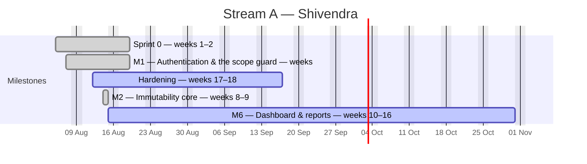
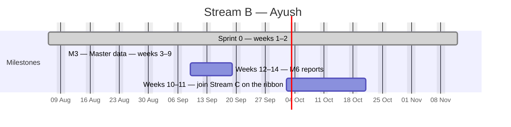
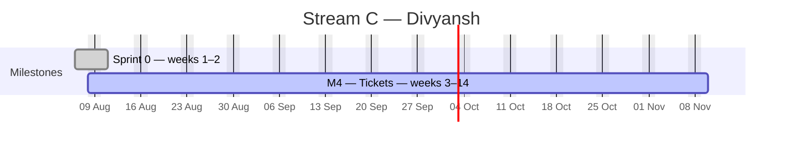
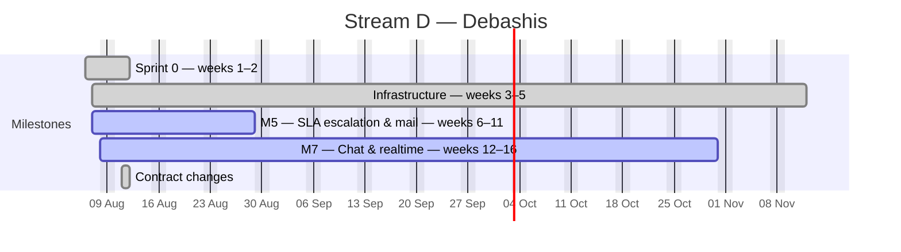

# EduTrack — Master Schedule

**Generated Tue 18 Aug 2026 · day 11 of the plan · finish forecast Tue 10 Nov**

> Regenerated automatically at 09:00 every working day by `tools/plan/schedule.py`. **Do not hand-edit.** Change an estimate or a dependency in [`tasks.csv`](tasks.csv); record a status git cannot see in [`overrides.json`](overrides.json).

Interactive chart: [`gantt.html`](gantt.html) · Today's briefs: [`standup/2026-08-18.md`](standup/2026-08-18.md)

---

## Where we are

| | Tasks | Effort (days) |
|---|---:|---:|
| Complete | 143 of 231 (62%) | 207.0 of 348.8 (59%) |
| In flight | 2 | 2.5 |
| On the driving chain | 42 | 61.0 |
| Zero float (no slack at all) | 27 | 44.0 |

### By developer

| Stream | Developer | Tasks | Done | Effort | Working days available | Load | Finishes |
|---|---|---:|---:|---:|---:|---:|---|
| **A** | Shivendra | 64 | 48 | 93.0 | 71 | 131% ⚠️ | Sat 31 Oct |
| **B** | Ayush | 51 | 30 | 84.8 | 71 | 119% ⚠️ | Tue 20 Oct |
| **C** | Divyansh | 67 | 25 | 99.5 | 71 | 140% ⚠️ | Tue 10 Nov |
| **D** | Debashis | 49 | 40 | 71.5 | 71 | 101% ⚠️ | Sat 31 Oct |

### Slipping

| Task | Owner | Baseline end | Forecast end | Slip |
|---|---|---|---|---:|
| `A-023` Opaque refresh token, 7 days, HttpOnly + Secure  | Shivendra | Fri 14 Aug | Mon 10 Aug | +63d |
| `A-025` Logout | Shivendra | Tue 18 Aug | Mon 10 Aug | +61d |
| `A-026` Forced password change on first login — must_cha | Shivendra | Wed 19 Aug | Mon 10 Aug | +60d |
| `B-007` Ticket fixture corpus | Ayush | Wed 19 Aug | Mon 10 Aug | +60d |
| `A-027` Forgot/reset password — single-use, 30-min TTL,  | Shivendra | Thu 20 Aug | Mon 10 Aug | +59d |
| `C-011` Ticket ID generation | Divyansh | Thu 20 Aug | Mon 10 Aug | +59d |
| `B-006` MapStruct base configuration | Ayush | Fri 21 Aug | Mon 10 Aug | +58d |
| `B-031` Step 1 — template download | Ayush | Tue 25 Aug | Mon 17 Aug | +57d |
| `C-010` Create ticket — all field groups from blueprint  | Divyansh | Tue 25 Aug | Mon 10 Aug | +56d |
| `C-013` Actions: Save & Assign · Save as Draft · Save &  | Divyansh | Wed 26 Aug | Mon 10 Aug | +55d |
| `C-015` Saved views | Divyansh | Tue 01 Sep | Mon 10 Aug | +51d |
| `C-016` Row colour cues | Divyansh | Wed 02 Sep | Mon 10 Aug | +50d |
| `A-052` /tickets/{id}/full aggregated endpoint | Shivendra | Fri 18 Sep | Sun 16 Aug | +40d |
| `C-028` Delete within 15 minutes by the uploader; after  | Divyansh | Fri 18 Sep | Sun 16 Aug | +40d |
| `C-030` @mention type-ahead over project members, firing | Divyansh | Wed 23 Sep | Mon 17 Aug | +36d |
| `D-013` Channel interceptor authorising subscriptions wi | Debashis | Tue 22 Sep | Mon 10 Aug | +36d |
| `C-031` Visibility toggle — default internal, always | Divyansh | Thu 24 Sep | Mon 17 Aug | +35d |
| `A-053` Cursor pagination + virtualised grid rendering b | Shivendra | Tue 29 Sep | Sun 16 Aug | +33d |
| `D-036` "Critical mails cannot be disabled" | Debashis | Tue 13 Oct | Mon 10 Aug | +21d |
| `B-024` Working-hours calculation service | Ayush | Thu 15 Oct | Mon 10 Aug | +19d |

*…and 27 more — see the interactive chart.*

---

## The chain that sets the finish date

Each of these is held up either by the one before it or by the fact that the same person has to do both. Shorten this chain and go-live moves; shorten anything else and it does not.

| # | Task | Owner | Title | Est | Start | End | Held up by |
|---:|---|---|---|---:|---|---|---|
| 1 | `C-038` | Divyansh | Reopen transaction — seal cycle N | 2.5 | Tue 18 Aug | Thu 20 Aug | — |
| 2 | `C-017` | Divyansh | Bulk select → reassign / change level / close (PM &  | 1.5 | Thu 20 Aug | Fri 21 Aug | Divyansh was busy on `C-038` |
| 3 | `C-020` | Divyansh | Priority dropdown | 1.5 | Sat 22 Aug | Tue 25 Aug | Divyansh was busy on `C-017` |
| 4 | `C-033` | Divyansh | 5-minute edit window, then locked with an "edited" m | 1.5 | Tue 25 Aug | Wed 26 Aug | Divyansh was busy on `C-020` |
| 5 | `C-035` | Divyansh | Effort logging, append-only, auto-stamped with curre | 1.5 | Thu 27 Aug | Fri 28 Aug | Divyansh was busy on `C-033` |
| 6 | `C-036` | Divyansh | Quick Update slide-over | 2.5 | Fri 28 Aug | Tue 01 Sep | `C-035` finished |
| 7 | `C-037` | Divyansh | Quick Update must not expose | 0.5 | Wed 02 Sep | Wed 02 Sep | `C-036` finished |
| 8 | `C-039` | Divyansh | Reopen dialog — mandatory reason, restart stage | 1.5 | Wed 02 Sep | Thu 03 Sep | Divyansh was busy on `C-037` |
| 9 | `C-040` | Divyansh | Close/resolve dialog | 1.5 | Fri 04 Sep | Sat 05 Sep | Divyansh was busy on `C-039` |
| 10 | `C-041` | Divyansh | Materialised total_effort_hrs, refreshed on every ef | 1 | Sat 05 Sep | Tue 08 Sep | Divyansh was busy on `C-040` |
| 11 | `C-059` | Divyansh | History tab | 1.5 | Tue 08 Sep | Wed 09 Sep | Divyansh was busy on `C-041` |
| 12 | `C-034` | Divyansh | Interleave comments into the History tab | 1.5 | Thu 10 Sep | Fri 11 Sep | `C-059` finished |
| 13 | `C-060` | Divyansh | Attachments tab | 1 | Fri 11 Sep | Sat 12 Sep | Divyansh was busy on `C-034` |
| 14 | `C-061` | Divyansh | Effort tab — every log line, sum per cycle + grand t | 1 | Sat 12 Sep | Tue 15 Sep | Divyansh was busy on `C-060` |
| 15 | `C-063` | Divyansh | Bulk reassignment wizard | 2 | Tue 15 Sep | Thu 17 Sep | Divyansh was busy on `C-061` |
| 16 | `C-064` | Divyansh | Ticket linking — blocks / is blocked by / duplicate  | 1.5 | Thu 17 Sep | Fri 18 Sep | Divyansh was busy on `C-063` |
| 17 | `C-065` | Divyansh | product_modules master + the four columns on tickets | 0.5 | Sat 19 Sep | Sat 19 Sep | Divyansh was busy on `C-064` |
| 18 | `C-067` | Divyansh | Backend wiring for all four fields | 1 | Sat 19 Sep | Tue 22 Sep | `C-065` finished |
| 19 | `C-068` | Divyansh | Create form S-19 — the new "Where it happened" group | 1 | Tue 22 Sep | Wed 23 Sep | `C-067` finished |
| 20 | `C-069` | Divyansh | Detail page S-20 shows all four, inline-editable | 0.5 | Wed 23 Sep | Wed 23 Sep | Divyansh was busy on `C-068` |
| 21 | `C-070` | Divyansh | List S-17 gains a Module filter | 0.5 | Thu 24 Sep | Thu 24 Sep | Divyansh was busy on `C-069` |
| 22 | `C-021` | Divyansh | Client + client-contact dependent dropdowns, type-ah | 2 | Thu 24 Sep | Sat 26 Sep | Divyansh was busy on `C-070` |
| 23 | `C-022` | Divyansh | Client-raised flag driving client-wise reports, CSAT | 0.5 | Sat 26 Sep | Sat 26 Sep | `C-021` finished |
| 24 | `C-042` | Divyansh | Transition service | 2.5 | Tue 29 Sep | Thu 01 Oct | Divyansh was busy on `C-022` |
| 25 | `C-043` | Divyansh | The golden rule — only the current stage owner | 1.5 | Thu 01 Oct | Fri 02 Oct | `C-042` finished |
| 26 | `C-032` | Divyansh | Stamping | 1 | Sat 03 Oct | Sat 03 Oct | Divyansh was busy on `C-043` |
| 27 | `C-044` | Divyansh | Handoff dialog — next stage | 2.5 | Tue 06 Oct | Thu 08 Oct | Divyansh was busy on `C-032` |
| 28 | `C-045` | Divyansh | On submit: seal the current row | 2 | Thu 08 Oct | Sat 10 Oct | `C-044` finished |
| 29 | `C-046` | Divyansh | Backward moves | 1.5 | Sat 10 Oct | Tue 13 Oct | Divyansh was busy on `C-045` |
| 30 | `C-047` | Divyansh | Skip a stage | 1 | Wed 14 Oct | Wed 14 Oct | Divyansh was busy on `C-046` |
| 31 | `C-048` | Divyansh | Force-move (OVERRIDE) — PM/Admin, logged as an overr | 1 | Thu 15 Oct | Thu 15 Oct | Divyansh was busy on `C-047` |
| 32 | `C-049` | Divyansh | Reassignment within a stage does not create a new se | 1.5 | Fri 16 Oct | Sat 17 Oct | Divyansh was busy on `C-048` |
| 33 | `C-050` | Divyansh | Unassigned receiving role → ticket falls to a projec | 1 | Sat 17 Oct | Tue 20 Oct | Divyansh was busy on `C-049` |
| 34 | `C-055` | Divyansh | Roll-up grid | 2 | Tue 20 Oct | Thu 22 Oct | Divyansh was busy on `C-050` |
| 35 | `C-056` | Divyansh | Active vs idle split | 1.5 | Thu 22 Oct | Fri 23 Oct | `C-055` finished |
| 36 | `C-057` | Divyansh | Per-resource roll-up + cycle total + all-cycles tota | 1.5 | Sat 24 Oct | Tue 27 Oct | `C-056` finished |
| 37 | `C-058` | Divyansh | Roll-up query | 1 | Tue 27 Oct | Wed 28 Oct | Divyansh was busy on `C-057` |
| 38 | `C-062` | Divyansh | Stage Queue / team inbox | 2 | Wed 28 Oct | Fri 30 Oct | Divyansh was busy on `C-058` |
| 39 | `C-051` | Divyansh | Ribbon component | 3 | Fri 30 Oct | Wed 04 Nov | Divyansh was busy on `C-062` |
| 40 | `C-052` | Divyansh | Interactions | 2 | Wed 04 Nov | Fri 06 Nov | `C-051` finished |
| 41 | `C-053` | Divyansh | Cycle selector above the ribbon; selecting cycle 1 r | 1.5 | Fri 06 Nov | Sat 07 Nov | Divyansh was busy on `C-052` |
| 42 | `C-054` | Divyansh | Cycle 2 · Iteration 3 chips | 1 | Tue 10 Nov | Tue 10 Nov | Divyansh was busy on `C-053` |

---

## Timeline by milestone

Bars reflect where the work is actually scheduled, not the week the backlog heading names. A developer with nothing else ready pulls later work forward rather than idling, so a milestone can start earlier than its title suggests.

### Stream A — Platform & Security · Shivendra

### Stream B — Masters & Clients · Ayush

### Stream C — Tickets & Ribbon · Divyansh

### Stream D — Engines & Realtime · Debashis

---

## Every task

`▲` critical path · `🔴` another developer is waiting on it · float is working days of slack before the finish date moves.

<b>Stream A — Platform & Security · Shivendra · 64 tasks</b>

| | Task | Title | Est | Predecessors | Start | End | Float | Status |
|---|---|---|---:|---|---|---|---:|---|
|  | `A-001` | Maven multi-module skeleton: common, domain, api, worker | 1 | — | Tue 18 Aug | Tue 18 Aug | 58 | ✅ done |
|  | `A-002` | docker-compose.yml — MySQL 8.4, Redis 7, MinIO, Mailpit | 1 | `A-001` | Tue 18 Aug | Tue 18 Aug | 59 | ✅ done |
|  | `A-003` | Flyway baseline 1/5 — identity | 1 | `A-002` | Wed 05 Aug | Wed 05 Aug | 0 | ✅ done |
|  | `A-004` | Flyway baseline 2/5 — tickets | 1.5 | `A-003` | Wed 05 Aug | Wed 05 Aug | 25 | ✅ done |
|  | `A-005` | Flyway baseline 3/5 — workflow | 1 | `A-004` | Wed 05 Aug | Wed 05 Aug | 26 | ✅ done |
|  | `A-006` | Flyway baseline 4/5 — clients & content | 1.5 | `A-007` | Thu 06 Aug | Thu 06 Aug | 0 | ✅ done |
|  | `A-007` | Flyway baseline 5/5 — masters & ops | 1.5 | `A-005` | Tue 18 Aug | Tue 18 Aug | 59 | ✅ done |
|  | `A-008` | Immutability triggers — two per table | 1 | `A-004` `A-005` | Tue 18 Aug | Tue 18 Aug | 58 | ✅ done |
|  | `A-009` | Generated columns + indexes replacing PostgreSQL partial indexes | 0.5 | `A-006` | Tue 18 Aug | Tue 18 Aug | 43 | ✅ done |
|  | `A-010` | Two DB users: edutrack_app | 0.5 | `A-009` ᶦ | Thu 06 Aug | Thu 06 Aug | 16 | ✅ done |
|  | `A-011` | CI pipeline | 1.5 | `A-001` | Tue 18 Aug | Tue 18 Aug | 60 | ✅ done |
| 🔴 | `A-012` | dev-noauth Spring profile — injects a configurable fake principal | 1.5 | `A-003` | Thu 06 Aug | Thu 06 Aug | 0 | ✅ done |
|  | `A-013` | Negative tests proving triggers reject UPDATE and DELETE on each… | 1 | `A-008` | Thu 06 Aug | Fri 07 Aug | 15 | ✅ done |
|  | `A-020` | Login endpoint — Argon2id | 1.5 | `A-003` `A-012` ᶦ | Fri 07 Aug | Fri 07 Aug | 0 | ✅ done |
|  | `A-021` | failed_attempts counter, 15-minute lockout at 5, email to Admin on… | 0.5 | `A-020` ᶦ | Sat 08 Aug | Sat 08 Aug | 66 | ✅ done |
|  | `A-022` | JWT access token, 15 min, claims sub, role, permissions[]… | 1 | `A-020` ᶦ | Sat 08 Aug | Sat 08 Aug | 0 | ✅ done |
|  | `A-023` | Opaque refresh token, 7 days, HttpOnly + Secure + SameSite=Strict… | 1 | `A-022` ᶦ | Sat 08 Aug | Mon 10 Aug | 0 | ✅ done |
| 🔴 | `A-024` | Refresh rotation with family revocation | 1.5 | `A-023` | Sat 08 Aug | Sat 08 Aug | 66 | ✅ done |
|  | `A-025` | Logout | 1 | `A-023` ᶦ | Sat 08 Aug | Mon 10 Aug | 0 | ✅ done |
|  | `A-026` | Forced password change on first login — must_change_password | 0.5 | `A-020` ᶦ | Mon 10 Aug | Mon 10 Aug | 0 | ✅ done |
|  | `A-027` | Forgot/reset password — single-use, 30-min TTL, hashed at rest | 1 | `A-020` ᶦ | Mon 10 Aug | Mon 10 Aug | 0 | ✅ done |
|  | `A-028` | Password policy | 1 | `A-020` ᶦ | Tue 11 Aug | Tue 11 Aug | 65 | ✅ done |
|  | `A-029` | 2FA — 6-digit TOTP, optional per user | 1.5 | `A-022` ᶦ | Tue 11 Aug | Tue 11 Aug | 65 | ✅ done |
|  | `A-030` | Login screen | 1.5 | `A-020` `C-003` | Tue 18 Aug | Tue 18 Aug | 59 | ✅ done |
|  | `A-031` | Role-based post-login redirect | 0.5 | `A-030` `B-001` | Wed 12 Aug | Wed 12 Aug | 64 | ✅ done |
|  | `A-032` | Spring Security filter chain — token valid and unrevoked | 1 | `A-022` | Wed 12 Aug | Wed 12 Aug | 0 | ✅ done |
|  | `A-033` | Permission model + @PreAuthorize | 1.5 | `A-032` `B-001` | Thu 13 Aug | Thu 13 Aug | 0 | ✅ done |
| 🔴 | `A-034` | ScopeResolver producing a JPA Specification per role | 2 | `A-033` | Thu 13 Aug | Thu 13 Aug | 0 | ✅ done |
|  | `A-035` | Out-of-scope IDs return 404, not 403, on /tickets/{id} and every… | 0.5 | `A-034` | Thu 13 Aug | Thu 13 Aug | 49 | ✅ done |
| 🔴 | `A-036` | Permission test matrix | 2 | `A-035` | Thu 13 Aug | Thu 13 Aug | 50 | ✅ done |
|  | `A-037` | ArchUnit rules | 1 | `A-034` ᶦ | Thu 13 Aug | Thu 13 Aug | 63 | ✅ done |
|  | `A-040` | Append-only services for the three protected tables | 1.5 | `A-010` `A-013` | Fri 14 Aug | Fri 14 Aug | 11 | ✅ done |
|  | `A-041` | Canonical JSON serialiser — fixed key order, fixed timestamp format | 1.5 | `A-040` | Fri 14 Aug | Fri 14 Aug | 19 | ✅ done |
| 🔴 | `A-042` | Per-ticket hash chain with SELECT … FOR UPDATE on the ticket row… | 2.5 | `A-041` | Fri 14 Aug | Fri 14 Aug | 20 | ✅ done |
|  | `A-043` | Compensating-entry pattern — is_correction, corrects_entry_id | 1 | `A-042` | Fri 14 Aug | Fri 14 Aug | 62 | ✅ done |
|  | `A-044` | Nightly chain verifier in worker, admin alert on break… | 2 | `A-042` | Fri 14 Aug | Fri 14 Aug | 62 | ✅ done |
|  | `A-045` | Concurrency test | 1.5 | `A-042` | Fri 14 Aug | Fri 14 Aug | 62 | ✅ done |
|  | `A-050` | daily_ticket_stats and resource_daily_stats summary tables | 1.5 | `A-034` `B-007` ᶦ | Sat 15 Aug | Sat 15 Aug | 21 | ✅ done |
|  | `A-051` | 5-minute refresh worker. Dashboard reads never issue live COUNT() | 1 | `A-050` | Sat 15 Aug | Sat 15 Aug | 22 | ✅ done |
|  | `A-052` | /tickets/{id}/full aggregated endpoint | 1 | `A-034` ᶦ | Sun 16 Aug | Sun 16 Aug | 0 | ✅ done |
|  | `A-053` | Cursor pagination + virtualised grid rendering beyond 200 rows | 1.5 | `A-052` `C-003` ᶦ | Sun 16 Aug | Sun 16 Aug | 0 | ✅ done |
|  | `A-054` | Shell, role-aware, with project/date/resource filters | 1.5 | `A-051` `C-005` ᶦ | Sun 16 Aug | Sun 16 Aug | 0 | ✅ done |
|  | `A-055` | Widgets 1–6 — KPI cards with sparklines and animated count-up | 2 | `A-054` ᶦ | Sun 16 Aug | Sun 16 Aug | 0 | ✅ done |
|  | `A-056` | Widgets 7–12 | 3 | `A-055` ᶦ | Sun 16 Aug | Sun 16 Aug | 0 | ✅ done |
|  | `A-057` | Widgets 13–15 — calendar heatmap, SLA radial gauge, project treemap | 2 | `A-056` ᶦ | Sun 16 Aug | Sun 16 Aug | 0 | ✅ done |
|  | `A-058` | Widgets 16–19 — stage funnel, rework/ping-pong, avg time per stage | 2.5 | `A-056` `C-049` | Tue 20 Oct | Thu 22 Oct | 10 | ▫️ to do |
|  | `A-059` | Widget 20 — client-wise volume. Depends on Stream B's client master | 1 | `A-056` `B-029` | Thu 17 Sep | Thu 17 Sep | 30 | ▫️ to do |
|  | `A-060` | Every card and chart segment deep-links to a pre-filtered list | 1.5 | `A-056` `C-014` ᶦ | Sun 16 Aug | Sun 16 Aug | 0 | ✅ done |
|  | `A-061` | Drill-down modal, slides from the right, CSV export | 1.5 | `A-060` ᶦ | Mon 17 Aug | Mon 17 Aug | 0 | ✅ done |
|  | `A-062` | Developer dashboard variant | 1.5 | `A-055` ᶦ | Tue 18 Aug | Wed 19 Aug | 24 | ▫️ to do |
|  | `A-063` | Reports hub | 2 | `A-051` `C-003` ᶦ | Wed 19 Aug | Fri 21 Aug | 25 | ▫️ to do |
|  | `A-064` | Export engine — Excel, CSV, PDF | 2 | `A-063` ᶦ | Fri 21 Aug | Tue 25 Aug | 26 | ▫️ to do |
|  | `A-065` | Scheduled report email (daily/weekly/monthly) | 1 | `A-064` `D-029` | Sat 19 Sep | Sat 19 Sep | 30 | ▫️ to do |
|  | `A-066` | Reports 1–6 | 3 | `A-063` ᶦ | Tue 25 Aug | Fri 28 Aug | 27 | ▫️ to do |
|  | `A-067` | Reports 7–12 | 3 | `A-066` ᶦ | Fri 28 Aug | Wed 02 Sep | 28 | ▫️ to do |
|  | `A-068` | Reports 13–18 | 3 | `A-067` `C-058` | Thu 29 Oct | Sat 31 Oct | 6 | ▫️ to do |
|  | `A-069` | Resource 360° profile | 1.5 | `A-066` `B-010` | Wed 02 Sep | Thu 03 Sep | 29 | ▫️ to do |
|  | `A-070` | "Born critical vs became critical" report | 1 | `A-066` `D-028` | Fri 18 Sep | Fri 18 Sep | 30 | ▫️ to do |
|  | `A-071` | Audit Log Viewer | 1.5 | `A-034` ᶦ | Fri 04 Sep | Sat 05 Sep | 29 | ▫️ to do |
|  | `A-072` | Global search + ticket-ID deep link | 1.5 | `A-009` `C-005` ᶦ | Sat 05 Sep | Tue 08 Sep | 30 | ▫️ to do |
|  | `A-073` | Performance | 2 | `A-053` `B-007` ᶦ | Wed 09 Sep | Thu 10 Sep | 30 | ▫️ to do |
|  | `A-074` | Security | 2 | `A-036` ᶦ | Fri 11 Sep | Sat 12 Sep | 30 | ▫️ to do |
|  | `A-075` | Go-live runbook, deployment, TLS, secrets in vault | 2 | `A-073` `A-074` ᶦ | Tue 15 Sep | Wed 16 Sep | 30 | ▫️ to do |
|  | `A-076` | Login throttle — the half A-021 deferred | 1 | — | Wed 12 Aug | Wed 12 Aug | 64 | ✅ done |

<b>Stream B — Masters & Clients · Ayush · 51 tasks</b>

| | Task | Title | Est | Predecessors | Start | End | Float | Status |
|---|---|---|---:|---|---|---|---:|---|
|  | `B-001` | Seed: 6 roles + the full permission matrix from blueprint §2 | 1 | `A-003` | Thu 06 Aug | Thu 06 Aug | 0 | ✅ done |
|  | `B-002` | Seed: 11 task types | 1 | `A-007` | Fri 07 Aug | Fri 07 Aug | 20 | ✅ done |
|  | `B-003` | Seed: statuses | 1 | `A-007` | Fri 07 Aug | Fri 07 Aug | 19 | ✅ done |
|  | `B-004` | Seed: 3 workflow templates with their stages — Standard Dev Flow | 1 | `A-005` | Fri 07 Aug | Fri 07 Aug | 25 | ✅ done |
|  | `B-005` | JPA entities + repositories for the full model, built on A's schema | 3 | `A-006` `A-007` | Sat 08 Aug | Sat 08 Aug | 0 | ✅ done |
|  | `B-006` | MapStruct base configuration | 0.5 | `B-005` ᶦ | Sat 08 Aug | Mon 10 Aug | 0 | ✅ done |
| 🔴 | `B-007` | Ticket fixture corpus | 2 | `B-004` `B-005` | Mon 10 Aug | Mon 10 Aug | 0 | ✅ done |
|  | `B-008` | Seed manifest with fixed load order | 0.5 | `B-001` `B-002` `B-003` `B-004` ᶦ | Sat 08 Aug | Sat 08 Aug | 66 | ✅ done |
|  | `B-010` | Resource list | 2 | `B-005` `C-003` `A-012` | Tue 11 Aug | Tue 11 Aug | 41 | ✅ done |
|  | `B-011` | Resource create/edit | 2.5 | `B-010` ᶦ | Tue 11 Aug | Tue 11 Aug | 42 | ✅ done |
| 🔴 | `B-012` | Reporting-manager cycle detection | 1 | `B-011` ᶦ | Wed 12 Aug | Wed 12 Aug | 64 | ✅ done |
|  | `B-013` | Validations | 1 | `B-011` ᶦ | Wed 12 Aug | Wed 12 Aug | 64 | ✅ done |
|  | `B-014` | Deactivating a resource with open tickets forces the bulk… | 1 | `B-011` ᶦ | Wed 12 Aug | Wed 12 Aug | 42 | ✅ done |
|  | `B-015` | Role & permission master — module × CRUD/approve checkbox matrix | 2 | `B-001` `C-003` ᶦ | Thu 13 Aug | Thu 13 Aug | 63 | ✅ done |
|  | `B-016` | Project master list/create/edit — code | 2 | `B-005` `C-003` ᶦ | Thu 13 Aug | Thu 13 Aug | 61 | ✅ done |
|  | `B-017` | Team tab — resources + per-project role | 1.5 | `B-016` ᶦ | Thu 13 Aug | Fri 14 Aug | 62 | ✅ done |
|  | `B-018` | SLA tab | 1.5 | `B-016` ᶦ | Fri 14 Aug | Fri 14 Aug | 61 | ✅ done |
|  | `B-019` | Settings tab | 1.5 | `B-016` ᶦ | Fri 14 Aug | Fri 14 Aug | 62 | ✅ done |
|  | `B-020` | Task type master — the 11 seeded types, Admin-extensible | 1.5 | `B-002` `C-003` ᶦ | Sat 15 Aug | Sat 15 Aug | 61 | ✅ done |
|  | `B-021` | Priority master | 1.5 | `B-002` `C-003` | Sat 15 Aug | Sat 15 Aug | 15 | ✅ done |
|  | `B-022` | Notification template master | 2 | `B-005` `C-003` | Sat 15 Aug | Sat 15 Aug | 46 | ✅ done |
|  | `B-023` | Working calendar & holiday master | 2 | `B-005` `C-003` | Mon 10 Aug | Mon 10 Aug | 0 | ✅ done |
| 🔴 | `B-024` | Working-hours calculation service | 3 | `B-023` | Mon 10 Aug | Mon 10 Aug | 0 | ✅ done |
|  | `B-025` | Client list | 2 | `B-005` `C-003` ᶦ | Sun 16 Aug | Sun 16 Aug | 0 | ✅ done |
|  | `B-026` | Client create/edit across four tabs | 3 | `B-025` ᶦ | Sun 16 Aug | Sun 16 Aug | 0 | ✅ done |
|  | `B-027` | client_contacts child grid | 1.5 | `B-026` ᶦ | Sun 16 Aug | Sun 16 Aug | 0 | ✅ done |
|  | `B-028` | Validation | 1 | `B-027` | Sun 16 Aug | Sun 16 Aug | 0 | ✅ done |
|  | `B-029` | Deactivating a client with open tickets warns and blocks new… | 1 | `B-026` ᶦ | Sun 16 Aug | Sun 16 Aug | 0 | ✅ done |
| 🔴 | `B-030` | Import engine as a schema registry — built once, registered twice | 2 | `B-005` | Tue 11 Aug | Tue 11 Aug | 1 | ✅ done |
|  | `B-031` | Step 1 — template download | 1.5 | `B-030` ᶦ | Mon 17 Aug | Mon 17 Aug | 0 | ✅ done |
|  | `B-032` | Step 2 — upload, max 5 MB / 5,000 rows, event-driven SAX parse | 2 | `B-030` ᶦ | Tue 18 Aug | Wed 19 Aug | 0 | ▫️ to do |
|  | `B-033` | Step 3 | 2 | `B-032` ᶦ | Thu 20 Aug | Fri 21 Aug | 0 | ▫️ to do |
| 🔴 | `B-034` | Step 4 — dry-run validation preview | 2.5 | `B-033` | Sat 22 Aug | Wed 26 Aug | 0 | ▫️ to do |
|  | `B-035` | Step 5 — commit as a background job with progress bar | 2 | `B-034` | Wed 26 Aug | Fri 28 Aug | 0 | ▫️ to do |
|  | `B-036` | Error report generation | 1 | `B-034` ᶦ | Fri 28 Aug | Sat 29 Aug | 0 | ▫️ to do |
|  | `B-037` | import_batches traceability | 1 | `B-035` ᶦ | Sat 29 Aug | Tue 01 Sep | 0 | ▫️ to do |
|  | `B-038` | Resource bulk import — the second registration, not a second build | 1 | `B-035` | Tue 01 Sep | Wed 02 Sep | 1 | ▫️ to do |
|  | `B-039` | Status/stage/workflow master tab 1 | 2 | `B-003` `C-003` ᶦ | Wed 02 Sep | Fri 04 Sep | 2 | ▫️ to do |
|  | `B-040` | Tab 2 — stages | 2 | `B-039` | Fri 04 Sep | Tue 08 Sep | 3 | ▫️ to do |
|  | `B-041` | Tab 3 | 2.5 | `B-040` `B-050` | Tue 06 Oct | Thu 08 Oct | 14 | ▫️ to do |
| 🔴 | `B-042` | Stages in use may be deprecated, never deleted | 1 | `B-040` | Tue 08 Sep | Wed 09 Sep | 18 | ▫️ to do |
|  | `B-043` | Workflow template designer | 3 | `B-041` `B-042` | Fri 09 Oct | Tue 13 Oct | 14 | ▫️ to do |
|  | `B-050` | Ribbon segment component — 6 states | 2.5 | `C-003` `C-042` | Fri 02 Oct | Tue 06 Oct | 13 | ▫️ to do |
|  | `B-051` | Compact dot variant for the ticket list | 1 | `B-050` ᶦ | Wed 14 Oct | Wed 14 Oct | 14 | ▫️ to do |
|  | `B-052` | Ribbon accessibility | 1.5 | `B-050` ᶦ | Thu 15 Oct | Fri 16 Oct | 14 | ▫️ to do |
|  | `B-053` | Readability at 8 stages on a laptop | 2 | `B-050` ᶦ | Fri 16 Oct | Tue 20 Oct | 15 | ▫️ to do |
|  | `B-060` | Client report | 2 | `A-064` `B-029` | Wed 09 Sep | Fri 11 Sep | 19 | ▫️ to do |
|  | `B-061` | Resource performance scorecard and workload/capacity report | 2 | `A-064` `B-010` | Fri 11 Sep | Tue 15 Sep | 20 | ▫️ to do |
|  | `B-062` | Export engine integration for all report types | 1.5 | `A-064` | Tue 15 Sep | Wed 16 Sep | 21 | ▫️ to do |
|  | `B-063` | Timesheet view — stage-aware, a resource's week across all tickets | 2 | `A-064` `C-061` | Thu 17 Sep | Fri 18 Sep | 21 | ▫️ to do |
| 🔴 | `B-064` | Module master read endpoint | 0.25 | `C-065` | Tue 22 Sep | Tue 22 Sep | 20 | ▫️ to do |

<b>Stream C — Tickets & Ribbon · Divyansh · 67 tasks</b>

| | Task | Title | Est | Predecessors | Start | End | Float | Status |
|---|---|---|---:|---|---|---|---:|---|
|  | `C-001` | Vite + React 18 + TypeScript scaffold, TanStack Query, Zustand… | 1 | — | Thu 06 Aug | Thu 06 Aug | 0 | ✅ done |
| 🔴 | `C-002` | Design tokens from blueprint §12.1 → tokens.css + tailwind.config.ts | 1.5 | `C-001` | Fri 07 Aug | Fri 07 Aug | 0 | ✅ done |
|  | `C-003` | Shared component library | 3 | `C-002` | Fri 07 Aug | Fri 07 Aug | 0 | ✅ done |
|  | `C-004` | Storybook, with every shared component documented | 1.5 | `C-003` | Fri 07 Aug | Fri 07 Aug | 67 | ✅ done |
|  | `C-005` | App shell | 2 | `C-003` | Fri 07 Aug | Fri 07 Aug | 0 | ✅ done |
|  | `C-006` | Command palette on Ctrl+K for jump-to-ticket | 1 | `C-005` ᶦ | Sat 08 Aug | Sat 08 Aug | 66 | ✅ done |
|  | `C-010` | Create ticket — all field groups from blueprint §7.5 | 2.5 | `C-005` `D-004` | Sat 08 Aug | Mon 10 Aug | 0 | ✅ done |
| 🔴 | `C-011` | Ticket ID generation | 1 | `A-003` `A-012` | Sat 08 Aug | Mon 10 Aug | 0 | ✅ done |
|  | `C-012` | SLA policy resolution → auto-computed Planned Close Date, previewed… | 1.5 | `C-011` `B-024` | Wed 12 Aug | Wed 12 Aug | 64 | ✅ done |
|  | `C-013` | Actions: Save & Assign · Save as Draft · Save & Create Another | 1.5 | `C-010` `C-011` ᶦ | Mon 10 Aug | Mon 10 Aug | 0 | ✅ done |
|  | `C-014` | Ticket list — filters | 3 | `C-005` `D-004` | Mon 10 Aug | Mon 10 Aug | 0 | ✅ done |
|  | `C-015` | Saved views | 1 | `C-014` ᶦ | Mon 10 Aug | Mon 10 Aug | 0 | ✅ done |
|  | `C-016` | Row colour cues | 0.5 | `C-014` ᶦ | Mon 10 Aug | Mon 10 Aug | 0 | ✅ done |
| ▲ | `C-017` | Bulk select → reassign / change level / close (PM & Admin only) | 1.5 | `C-014` `A-034` | Thu 20 Aug | Fri 21 Aug | 11 | ▫️ to do |
|  | `C-018` | My Tasks | 2.5 | `C-014` ᶦ | Tue 11 Aug | Tue 11 Aug | 25 | ✅ done |
|  | `C-019` | Detail shell + summary panel — every entity a link | 2 | `C-005` `D-004` | Tue 11 Aug | Tue 11 Aug | 19 | ✅ done |
| ▲ | `C-020` | Priority dropdown | 1.5 | `C-019` `B-021` | Sat 22 Aug | Tue 25 Aug | 11 | ▫️ to do |
| ▲ | `C-021` | Client + client-contact dependent dropdowns, type-ahead over… | 2 | `C-019` `B-028` | Thu 24 Sep | Sat 26 Sep | 0 | ▫️ to do |
| ▲ | `C-022` | Client-raised flag driving client-wise reports, CSAT and the… | 0.5 | `C-021` ᶦ | Sat 26 Sep | Sat 26 Sep | 0 | ▫️ to do |
|  | `C-023` | Upload surfaces | 1.5 | `C-019` ᶦ | Wed 12 Aug | Wed 12 Aug | 36 | ✅ done |
| 🔴 | `C-024` | Clipboard paste alongside drag-drop and file picker | 1 | `C-023` ᶦ | Fri 14 Aug | Fri 14 Aug | 62 | ✅ done |
|  | `C-025` | Security | 2 | `C-023` ᶦ | Fri 14 Aug | Fri 14 Aug | 35 | ✅ done |
|  | `C-026` | Thumbnails, gallery strip, lightbox with zoom and next/previous | 1.5 | `C-025` ᶦ | Sat 15 Aug | Sat 15 Aug | 35 | ✅ done |
|  | `C-027` | Limits — 10 MB/file, 50 MB/ticket, 20 files/ticket, all configurable | 0.5 | `C-025` ᶦ | Sat 15 Aug | Sat 15 Aug | 61 | ✅ done |
|  | `C-028` | Delete within 15 minutes by the uploader; after that a soft delete… | 1 | `C-025` ᶦ | Sun 16 Aug | Sun 16 Aug | 0 | ✅ done |
|  | `C-029` | Rich-text comment box under the description, always visible above… | 1.5 | `C-019` ᶦ | Sun 16 Aug | Sun 16 Aug | 0 | ✅ done |
|  | `C-030` | @mention type-ahead over project members, firing notification +… | 1.5 | `C-029` ᶦ | Mon 17 Aug | Mon 17 Aug | 0 | ✅ done |
|  | `C-031` | Visibility toggle — default internal, always | 1 | `C-029` ᶦ | Mon 17 Aug | Mon 17 Aug | 0 | ✅ done |
| ▲ | `C-032` | Stamping | 1 | `C-029` `C-042` | Sat 03 Oct | Sat 03 Oct | 0 | ▫️ to do |
| ▲ | `C-033` | 5-minute edit window, then locked with an "edited" marker and the… | 1.5 | `C-029` ᶦ | Tue 25 Aug | Wed 26 Aug | 12 | ▫️ to do |
| ▲🔴 | `C-034` | Interleave comments into the History tab | 1.5 | `C-029` `C-059` | Thu 10 Sep | Fri 11 Sep | 16 | ▫️ to do |
| ▲ | `C-035` | Effort logging, append-only, auto-stamped with current stage and… | 1.5 | `C-019` `A-040` | Thu 27 Aug | Fri 28 Aug | 12 | ▫️ to do |
| ▲ | `C-036` | Quick Update slide-over | 2.5 | `C-018` `C-035` ᶦ | Fri 28 Aug | Tue 01 Sep | 13 | ▫️ to do |
| ▲ | `C-037` | Quick Update must not expose | 0.5 | `C-036` ᶦ | Wed 02 Sep | Wed 02 Sep | 13 | ▫️ to do |
| ▲🔴 | `C-038` | Reopen transaction — seal cycle N | 2.5 | `C-013` `A-040` | Tue 18 Aug | Thu 20 Aug | 10 | ▫️ to do |
| ▲ | `C-039` | Reopen dialog — mandatory reason, restart stage | 1.5 | `C-038` ᶦ | Wed 02 Sep | Thu 03 Sep | 14 | ▫️ to do |
| ▲ | `C-040` | Close/resolve dialog | 1.5 | `C-038` ᶦ | Fri 04 Sep | Sat 05 Sep | 14 | ▫️ to do |
| ▲ | `C-041` | Materialised total_effort_hrs, refreshed on every effort insert | 1 | `C-035` ᶦ | Sat 05 Sep | Tue 08 Sep | 15 | ▫️ to do |
| ▲ | `C-042` | Transition service | 2.5 | `A-042` `B-040` | Tue 29 Sep | Thu 01 Oct | 0 | ▫️ to do |
| ▲🔴 | `C-043` | The golden rule — only the current stage owner | 1.5 | `C-042` `A-033` | Thu 01 Oct | Fri 02 Oct | 0 | ▫️ to do |
| ▲ | `C-044` | Handoff dialog — next stage | 2.5 | `C-042` `C-035` | Tue 06 Oct | Thu 08 Oct | 0 | ▫️ to do |
| ▲ | `C-045` | On submit: seal the current row | 2 | `C-044` `D-014` | Thu 08 Oct | Sat 10 Oct | 0 | ▫️ to do |
| ▲ | `C-046` | Backward moves | 1.5 | `C-042` ᶦ | Sat 10 Oct | Tue 13 Oct | 0 | ▫️ to do |
| ▲ | `C-047` | Skip a stage | 1 | `C-042` ᶦ | Wed 14 Oct | Wed 14 Oct | 0 | ▫️ to do |
| ▲ | `C-048` | Force-move (OVERRIDE) — PM/Admin, logged as an override | 1 | `C-042` ᶦ | Thu 15 Oct | Thu 15 Oct | 0 | ▫️ to do |
| ▲ | `C-049` | Reassignment within a stage does not create a new segment | 1.5 | `C-042` | Fri 16 Oct | Sat 17 Oct | 0 | ▫️ to do |
| ▲ | `C-050` | Unassigned receiving role → ticket falls to a project-level queue… | 1 | `C-044` ᶦ | Sat 17 Oct | Tue 20 Oct | 0 | ▫️ to do |
| ▲🔴 | `C-051` | Ribbon component | 3 | `B-050` | Fri 30 Oct | Wed 04 Nov | 0 | ▫️ to do |
| ▲ | `C-052` | Interactions | 2 | `C-051` ᶦ | Wed 04 Nov | Fri 06 Nov | 0 | ▫️ to do |
| ▲ | `C-053` | Cycle selector above the ribbon; selecting cycle 1 renders that… | 1.5 | `C-051` `C-038` | Fri 06 Nov | Sat 07 Nov | 0 | ▫️ to do |
| ▲ | `C-054` | Cycle 2 · Iteration 3 chips | 1 | `C-051` `C-046` | Tue 10 Nov | Tue 10 Nov | 0 | ▫️ to do |
| ▲ | `C-055` | Roll-up grid | 2 | `C-042` `B-024` | Tue 20 Oct | Thu 22 Oct | 0 | ▫️ to do |
| ▲🔴 | `C-056` | Active vs idle split | 1.5 | `C-055` | Thu 22 Oct | Fri 23 Oct | 0 | ▫️ to do |
| ▲ | `C-057` | Per-resource roll-up + cycle total + all-cycles total | 1.5 | `C-056` ᶦ | Sat 24 Oct | Tue 27 Oct | 0 | ▫️ to do |
| ▲ | `C-058` | Roll-up query | 1 | `C-055` | Tue 27 Oct | Wed 28 Oct | 0 | ▫️ to do |
| ▲ | `C-059` | History tab | 1.5 | `C-019` `A-040` | Tue 08 Sep | Wed 09 Sep | 16 | ▫️ to do |
| ▲ | `C-060` | Attachments tab | 1 | `C-026` ᶦ | Fri 11 Sep | Sat 12 Sep | 17 | ▫️ to do |
| ▲ | `C-061` | Effort tab — every log line, sum per cycle + grand total | 1 | `C-041` ᶦ | Sat 12 Sep | Tue 15 Sep | 18 | ▫️ to do |
| ▲ | `C-062` | Stage Queue / team inbox | 2 | `C-014` `C-042` | Wed 28 Oct | Fri 30 Oct | 0 | ▫️ to do |
| ▲ | `C-063` | Bulk reassignment wizard | 2 | `C-017` `B-014` | Tue 15 Sep | Thu 17 Sep | 19 | ▫️ to do |
| ▲ | `C-064` | Ticket linking — blocks / is blocked by / duplicate of / relates to | 1.5 | `C-019` ᶦ | Thu 17 Sep | Fri 18 Sep | 20 | ▫️ to do |
| ▲ | `C-065` | product_modules master + the four columns on tickets — table | 0.5 | `D-060` | Sat 19 Sep | Sat 19 Sep | 20 | ▫️ to do |
|  | `C-066` | Shared rich-text editor in components/ui/ + Storybook | 1.5 | `C-003` | Tue 11 Aug | Tue 11 Aug | 58 | ✅ done |
| ▲ | `C-067` | Backend wiring for all four fields | 1 | `C-065` `C-010` | Sat 19 Sep | Tue 22 Sep | 28 | ▫️ to do |
| ▲ | `C-068` | Create form S-19 — the new "Where it happened" group | 1 | `C-066` `C-067` | Tue 22 Sep | Wed 23 Sep | 29 | ▫️ to do |
| ▲ | `C-069` | Detail page S-20 shows all four, inline-editable | 0.5 | `C-019` `C-067` | Wed 23 Sep | Wed 23 Sep | 30 | ▫️ to do |
| ▲ | `C-070` | List S-17 gains a Module filter | 0.5 | `C-014` `C-067` | Thu 24 Sep | Thu 24 Sep | 30 | ▫️ to do |

<b>Stream D — Engines & Realtime · Debashis · 49 tasks</b>

| | Task | Title | Est | Predecessors | Start | End | Float | Status |
|---|---|---|---:|---|---|---|---:|---|
| 🔴 | `D-001` | OpenAPI contract for every endpoint in blueprint §13 | 3 | — | Thu 06 Aug | Sat 08 Aug | 0 | ✅ done |
|  | `D-002` | Conventions baked into the spec | 1 | `D-001` | Thu 06 Aug | Thu 06 Aug | 0 | ✅ done |
|  | `D-003` | springdoc config + codegen pipeline | 2 | `D-002` | Thu 06 Aug | Thu 06 Aug | 65 | ✅ done |
| 🔴 | `D-004` | MSW mock server returning realistic fixtures for every endpoint | 2.5 | `D-002` | Thu 06 Aug | Tue 11 Aug | 0 | ✅ done |
|  | `D-005` | CI staleness check | 1 | `D-003` | Thu 06 Aug | Sat 08 Aug | 66 | ✅ done |
| 🔴 | `D-010` | Outbox worker pattern | 2.5 | `A-006` `A-012` | Fri 07 Aug | Fri 07 Aug | 49 | ✅ done |
|  | `D-011` | @Scheduled + ShedLock | 1 | `D-010` ᶦ | Fri 07 Aug | Fri 07 Aug | 50 | ✅ done |
|  | `D-012` | Spring WebSocket + STOMP config, Redis pub/sub relay for… | 2 | `A-012` ᶦ | Fri 07 Aug | Fri 07 Aug | 0 | ✅ done |
| 🔴 | `D-013` | Channel interceptor authorising subscriptions with the same scope… | 2 | `D-012` `A-034` | Sat 08 Aug | Mon 10 Aug | 0 | ✅ done |
|  | `D-014` | Destination map per blueprint §9.3 | 1 | `D-012` | Fri 07 Aug | Fri 07 Aug | 34 | ✅ done |
|  | `D-015` | Frontend STOMP client | 1.5 | `D-014` `C-005` | Sat 08 Aug | Sat 08 Aug | 66 | ✅ done |
| 🔴 | `D-020` | SLA scanner, every 15 minutes | 2 | `D-011` `B-024` `A-009` | Mon 10 Aug | Mon 10 Aug | 0 | ✅ done |
|  | `D-021` | 80%-of-SLA pre-breach warning to the assignee | 1 | `D-020` ᶦ | Mon 10 Aug | Mon 10 Aug | 0 | ✅ done |
|  | `D-022` | Stale-task nudge — no update for 3 working days, to assignee cc RM | 1 | `D-020` ᶦ | Mon 10 Aug | Mon 10 Aug | 0 | ✅ done |
| 🔴 | `D-023` | Stage-SLA scanner, separate from ticket SLA | 2 | `D-020` `C-042` | Mon 10 Aug | Mon 10 Aug | 0 | ✅ done |
|  | `D-024` | Escalation matrix per project | 1.5 | `D-020` `B-018` | Mon 10 Aug | Mon 10 Aug | 0 | ✅ done |
|  | `D-025` | Ping-pong flag at iteration_no ≥ 3 → PM dashboard | 0.5 | `D-023` ᶦ | Tue 11 Aug | Tue 11 Aug | 65 | ✅ done |
|  | `D-026` | Unassigned ticket > 2 h → triage alert to PM and Support Desk | 1 | `D-020` ᶦ | Tue 11 Aug | Tue 11 Aug | 65 | ✅ done |
| 🔴 | `D-027` | Every calculation routes through Stream B's working-hours service | 1 | `D-020` | Mon 10 Aug | Mon 10 Aug | 0 | ✅ done |
|  | `D-028` | original_level preserved so "born critical vs became critical"… | 1 | `D-020` ᶦ | Tue 18 Aug | Tue 18 Aug | 45 | 🔵 in review |
|  | `D-029` | Thymeleaf templates driven by Stream B's notification template… | 1.5 | `D-010` `B-022` | Tue 18 Aug | Wed 19 Aug | 46 | 🟡 50% |
|  | `D-030` | Mail body | 1.5 | `D-029` ᶦ | Wed 19 Aug | Thu 20 Aug | 47 | ▫️ to do |
|  | `D-031` | Subject pattern with the ticket ID first so it threads and searches… | 0.5 | `D-029` ᶦ | Mon 10 Aug | Mon 10 Aug | 0 | ✅ done |
| 🔴 | `D-032` | Threading | 1.5 | `D-031` | Mon 10 Aug | Mon 10 Aug | 0 | ✅ done |
|  | `D-033` | Every send logged in email_log with status, provider message ID and… | 1 | `D-010` | Fri 07 Aug | Fri 07 Aug | 66 | ✅ done |
|  | `D-034` | Bounce and complaint webhooks | 1 | `D-033` ᶦ | Fri 07 Aug | Fri 07 Aug | 67 | ✅ done |
|  | `D-035` | Rate limit | 1 | `D-033` ᶦ | Fri 07 Aug | Fri 07 Aug | 67 | ✅ done |
| 🔴 | `D-036` | "Critical mails cannot be disabled" | 1 | `D-029` | Mon 10 Aug | Mon 10 Aug | 0 | ✅ done |
|  | `D-037` | All 15 mail events from §4B.6 wired | 2 | `D-030` `D-036` ᶦ | Fri 21 Aug | Sat 22 Aug | 47 | ▫️ to do |
|  | `D-038` | Daily digest 08:30 and weekly manager summary | 1.5 | `D-037` ᶦ | Tue 25 Aug | Wed 26 Aug | 47 | ▫️ to do |
|  | `D-039` | Inbound webhook — reply-to-comment parsing with quoted text stripped | 2 | `D-032` ᶦ | Wed 12 Aug | Wed 12 Aug | 64 | ✅ done |
|  | `D-040` | All 24 events from blueprint §11 across in-app / bell / email… | 2 | `D-012` `B-022` | Wed 26 Aug | Fri 28 Aug | 48 | ▫️ to do |
|  | `D-041` | Notification centre — bell dropdown (last 10) + full page with tabs | 2.5 | `D-040` `C-005` | Sat 08 Aug | Sat 08 Aug | 61 | ✅ done |
|  | `D-042` | Per-user preference matrix — which events, which channel | 1.5 | `D-041` ᶦ | Mon 10 Aug | Mon 10 Aug | 0 | ✅ done |
|  | `D-043` | In-app toast via WebSocket, appearing within ~1 second, with Open /… | 1 | `D-041` `D-014` ᶦ | Mon 10 Aug | Mon 10 Aug | 0 | ✅ done |
|  | `D-044` | Persistent bell badge with unread count | 0.5 | `D-041` ᶦ | Mon 10 Aug | Mon 10 Aug | 0 | ✅ done |
|  | `D-045` | Browser push via the Web Push API for users who opt in | 1.5 | `D-043` ᶦ | Tue 11 Aug | Fri 14 Aug | 62 | ✅ done |
| 🔴 | `D-046` | Offline queueing | 1.5 | `D-043` | Mon 10 Aug | Mon 10 Aug | 0 | ✅ done |
|  | `D-050` | Chat engine, three surfaces one engine | 3 | `D-014` `C-005` | Sat 08 Aug | Sat 08 Aug | 62 | ✅ done |
|  | `D-051` | Typing indicator, read receipts, unread counts | 2 | `D-050` ᶦ | Sat 08 Aug | Sat 08 Aug | 66 | ✅ done |
|  | `D-052` | @mentions firing notifications | 1.5 | `D-050` ᶦ | Sat 08 Aug | Sat 08 Aug | 66 | ✅ done |
|  | `D-053` | File and image share, emoji, message search | 2 | `D-050` ᶦ | Fri 28 Aug | Sat 29 Aug | 49 | ⛔ blocked |
|  | `D-054` | TKT-xxxx link preview rendering as a rich ticket card | 1 | `D-050` ᶦ | Thu 13 Aug | Thu 13 Aug | 63 | ✅ done |
| 🔴 | `D-055` | Ask Status | 1.5 | `D-050` `C-036` | Thu 13 Aug | Thu 13 Aug | 62 | ✅ done |
|  | `D-056` | Manager response time recorded as a reportable metric; status… | 1 | `D-055` ᶦ | Thu 13 Aug | Thu 13 Aug | 63 | ✅ done |
| 🔴 | `D-057` | Chat immutable after a 5-minute edit window; deletions leave… | 1.5 | `D-050` | Sat 08 Aug | Sat 08 Aug | 66 | ✅ done |
|  | `D-058` | Live ribbon advance | 1 | `D-014` `C-045` | Tue 13 Oct | Tue 13 Oct | 19 | ▫️ to do |
|  | `D-059` | Team inbox live updates | 1 | `D-058` `C-062` | Sat 31 Oct | Sat 31 Oct | 6 | ▫️ to do |
|  | `D-060` | Ticket "where it happened" fields in the contract and the mock… | 0.5 | `D-004` | Tue 11 Aug | Tue 11 Aug | 48 | ✅ done |

---

*`ᶦ` marks an **inferred** dependency — derived from task ordering, not confirmed by its owner. Correct them in `tasks.csv` and the critical path stops being a hypothesis.*
