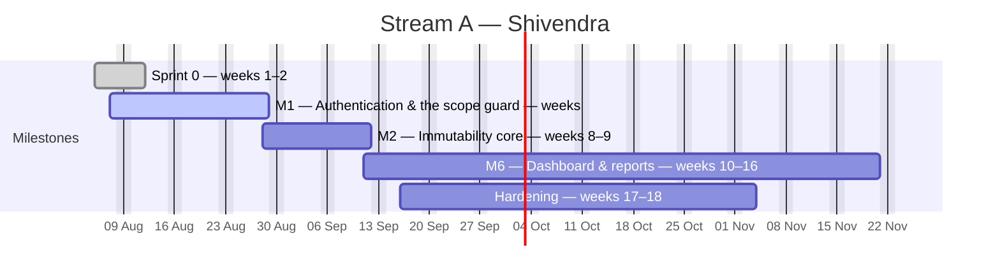
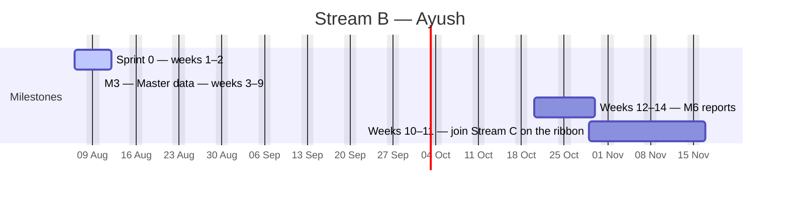
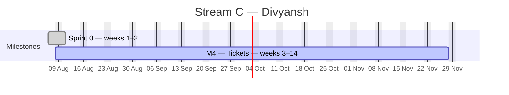
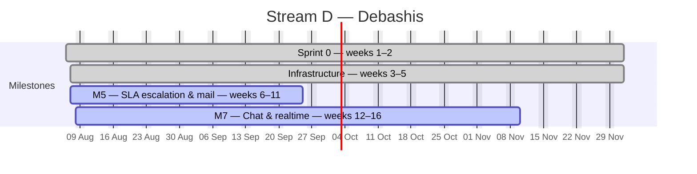

# EduTrack — Master Schedule

**Generated Tue 11 Aug 2026 · day 6 of the plan · finish forecast Sat 28 Nov**

> Regenerated automatically at 09:00 every working day by `tools/plan/schedule.py`. **Do not hand-edit.** Change an estimate or a dependency in [`tasks.csv`](tasks.csv); record a status git cannot see in [`overrides.json`](overrides.json).

Interactive chart: [`gantt.html`](gantt.html) · Today's briefs: [`standup/2026-08-11.md`](standup/2026-08-11.md)

---

## Where we are

| | Tasks | Effort (days) |
|---|---:|---:|
| Complete | 72 of 222 (32%) | 103.0 of 342.0 (30%) |
| In flight | 2 | 2.5 |
| On the driving chain | 49 | 81.5 |
| Zero float (no slack at all) | 109 | 169.5 |

### By developer

| Stream | Developer | Tasks | Done | Effort | Working days available | Load | Finishes |
|---|---|---:|---:|---:|---:|---:|---|
| **A** | Shivendra | 63 | 20 | 92.0 | 85 | 108% ⚠️ | Fri 20 Nov |
| **B** | Ayush | 50 | 9 | 84.5 | 85 | 99% | Sat 14 Nov |
| **C** | Divyansh | 61 | 11 | 94.5 | 85 | 111% ⚠️ | Sat 28 Nov |
| **D** | Debashis | 48 | 32 | 71.0 | 85 | 84% | Tue 10 Nov |

### Slipping

| Task | Owner | Baseline end | Forecast end | Slip |
|---|---|---|---|---:|
| `A-023` Opaque refresh token, 7 days, HttpOnly + Secure  | Shivendra | Fri 14 Aug | Mon 10 Aug | +77d |
| `D-004` MSW mock server returning realistic fixtures for | Debashis | Fri 14 Aug | Mon 10 Aug | +77d |
| `A-025` Logout | Shivendra | Tue 18 Aug | Mon 10 Aug | +75d |
| `A-026` Forced password change on first login — must_cha | Shivendra | Wed 19 Aug | Mon 10 Aug | +74d |
| `C-011` Ticket ID generation | Divyansh | Thu 20 Aug | Mon 10 Aug | +73d |
| `B-006` MapStruct base configuration | Ayush | Fri 21 Aug | Mon 10 Aug | +72d |
| `C-010` Create ticket — all field groups from blueprint  | Divyansh | Tue 25 Aug | Mon 10 Aug | +70d |
| `C-013` Actions: Save & Assign · Save as Draft · Save &  | Divyansh | Wed 26 Aug | Mon 10 Aug | +69d |
| `C-015` Saved views | Divyansh | Tue 01 Sep | Mon 10 Aug | +65d |
| `D-013` Channel interceptor authorising subscriptions wi | Debashis | Tue 22 Sep | Mon 10 Aug | +50d |
| `D-036` "Critical mails cannot be disabled" | Debashis | Tue 13 Oct | Mon 10 Aug | +35d |
| `B-024` Working-hours calculation service | Ayush | Thu 15 Oct | Mon 10 Aug | +33d |
| `D-031` Subject pattern with the ticket ID first so it t | Debashis | Thu 15 Oct | Mon 10 Aug | +33d |
| `D-032` Threading | Debashis | Fri 16 Oct | Mon 10 Aug | +32d |
| `B-031` Step 1 — template download | Ayush | Tue 25 Aug | Fri 25 Sep | +23d |
| `B-032` Step 2 — upload, max 5 MB / 5,000 rows, event-dr | Ayush | Thu 27 Aug | Tue 29 Sep | +23d |
| `B-034` Step 4 — dry-run validation preview | Ayush | Wed 02 Sep | Sat 03 Oct | +23d |
| `B-035` Step 5 — commit as a background job with progres | Ayush | Fri 04 Sep | Wed 07 Oct | +23d |
| `B-037` import_batches traceability | Ayush | Tue 08 Sep | Fri 09 Oct | +23d |
| `B-038` Resource bulk import — the second registration,  | Ayush | Wed 09 Sep | Sat 10 Oct | +23d |

*…and 23 more — see the interactive chart.*

---

## The chain that sets the finish date

Each of these is held up either by the one before it or by the fact that the same person has to do both. Shorten this chain and go-live moves; shorten anything else and it does not.

| # | Task | Owner | Title | Est | Start | End | Held up by |
|---:|---|---|---|---:|---|---|---|
| 1 | `A-007` | Shivendra | Flyway baseline 5/5 — masters & ops | 1.5 | Tue 11 Aug | Tue 11 Aug | — |
| 2 | `B-005` | Ayush | JPA entities + repositories for the full model, buil | 3 | Sat 08 Aug | Sat 08 Aug | `A-007` finished |
| 3 | `B-007` | Ayush | Ticket fixture corpus | 2 | Tue 11 Aug | Tue 11 Aug | `B-005` finished |
| 4 | `B-030` | Ayush | Import engine as a schema registry — built once, reg | 2 | Tue 11 Aug | Thu 13 Aug | Ayush was busy on `B-007` |
| 5 | `B-010` | Ayush | Resource list | 2 | Thu 13 Aug | Sat 15 Aug | Ayush was busy on `B-030` |
| 6 | `B-011` | Ayush | Resource create/edit | 2.5 | Sat 15 Aug | Wed 19 Aug | `B-010` finished |
| 7 | `B-012` | Ayush | Reporting-manager cycle detection | 1 | Thu 20 Aug | Thu 20 Aug | `B-011` finished |
| 8 | `B-013` | Ayush | Validations | 1 | Fri 21 Aug | Fri 21 Aug | Ayush was busy on `B-012` |
| 9 | `B-014` | Ayush | Deactivating a resource with open tickets forces the | 1 | Sat 22 Aug | Sat 22 Aug | Ayush was busy on `B-013` |
| 10 | `B-015` | Ayush | Role & permission master — module × CRUD/approve che | 2 | Tue 25 Aug | Wed 26 Aug | Ayush was busy on `B-014` |
| 11 | `B-016` | Ayush | Project master list/create/edit — code | 2 | Thu 27 Aug | Fri 28 Aug | Ayush was busy on `B-015` |
| 12 | `B-017` | Ayush | Team tab — resources + per-project role | 1.5 | Sat 29 Aug | Tue 01 Sep | `B-016` finished |
| 13 | `B-018` | Ayush | SLA tab | 1.5 | Tue 01 Sep | Wed 02 Sep | Ayush was busy on `B-017` |
| 14 | `B-019` | Ayush | Settings tab | 1.5 | Thu 03 Sep | Fri 04 Sep | Ayush was busy on `B-018` |
| 15 | `B-020` | Ayush | Task type master — the 11 seeded types, Admin-extens | 1.5 | Fri 04 Sep | Sat 05 Sep | Ayush was busy on `B-019` |
| 16 | `B-021` | Ayush | Priority master | 1.5 | Tue 08 Sep | Wed 09 Sep | Ayush was busy on `B-020` |
| 17 | `B-022` | Ayush | Notification template master | 2 | Wed 09 Sep | Fri 11 Sep | Ayush was busy on `B-021` |
| 18 | `B-025` | Ayush | Client list | 2 | Fri 11 Sep | Tue 15 Sep | Ayush was busy on `B-022` |
| 19 | `B-026` | Ayush | Client create/edit across four tabs | 3 | Tue 15 Sep | Fri 18 Sep | `B-025` finished |
| 20 | `B-027` | Ayush | client_contacts child grid | 1.5 | Fri 18 Sep | Sat 19 Sep | `B-026` finished |
| 21 | `B-028` | Ayush | Validation | 1 | Tue 22 Sep | Tue 22 Sep | `B-027` finished |
| 22 | `B-029` | Ayush | Deactivating a client with open tickets warns and bl | 1 | Wed 23 Sep | Wed 23 Sep | Ayush was busy on `B-028` |
| 23 | `B-031` | Ayush | Step 1 — template download | 1.5 | Thu 24 Sep | Fri 25 Sep | Ayush was busy on `B-029` |
| 24 | `B-032` | Ayush | Step 2 — upload, max 5 MB / 5,000 rows, event-driven | 2 | Fri 25 Sep | Tue 29 Sep | Ayush was busy on `B-031` |
| 25 | `B-033` | Ayush | Step 3 | 2 | Tue 29 Sep | Thu 01 Oct | `B-032` finished |
| 26 | `B-034` | Ayush | Step 4 — dry-run validation preview | 2.5 | Thu 01 Oct | Sat 03 Oct | `B-033` finished |
| 27 | `B-035` | Ayush | Step 5 — commit as a background job with progress ba | 2 | Tue 06 Oct | Wed 07 Oct | `B-034` finished |
| 28 | `B-036` | Ayush | Error report generation | 1 | Thu 08 Oct | Thu 08 Oct | Ayush was busy on `B-035` |
| 29 | `B-037` | Ayush | import_batches traceability | 1 | Fri 09 Oct | Fri 09 Oct | Ayush was busy on `B-036` |
| 30 | `B-038` | Ayush | Resource bulk import — the second registration, not  | 1 | Sat 10 Oct | Sat 10 Oct | Ayush was busy on `B-037` |
| 31 | `B-039` | Ayush | Status/stage/workflow master tab 1 | 2 | Tue 13 Oct | Wed 14 Oct | Ayush was busy on `B-038` |
| 32 | `B-040` | Ayush | Tab 2 — stages | 2 | Thu 15 Oct | Fri 16 Oct | `B-039` finished |
| 33 | `C-042` | Divyansh | Transition service | 2.5 | Sat 17 Oct | Wed 21 Oct | `B-040` finished |
| 34 | `C-032` | Divyansh | Stamping | 1 | Wed 21 Oct | Thu 22 Oct | `C-042` finished |
| 35 | `C-044` | Divyansh | Handoff dialog — next stage | 2.5 | Thu 22 Oct | Sat 24 Oct | Divyansh was busy on `C-032` |
| 36 | `C-045` | Divyansh | On submit: seal the current row | 2 | Tue 27 Oct | Wed 28 Oct | `C-044` finished |
| 37 | `C-046` | Divyansh | Backward moves | 1.5 | Thu 29 Oct | Fri 30 Oct | Divyansh was busy on `C-045` |
| 38 | `C-047` | Divyansh | Skip a stage | 1 | Fri 30 Oct | Sat 31 Oct | Divyansh was busy on `C-046` |
| 39 | `C-048` | Divyansh | Force-move (OVERRIDE) — PM/Admin, logged as an overr | 1 | Sat 31 Oct | Tue 03 Nov | Divyansh was busy on `C-047` |
| 40 | `C-049` | Divyansh | Reassignment within a stage does not create a new se | 1.5 | Tue 03 Nov | Wed 04 Nov | Divyansh was busy on `C-048` |
| 41 | `C-050` | Divyansh | Unassigned receiving role → ticket falls to a projec | 1 | Thu 05 Nov | Thu 05 Nov | Divyansh was busy on `C-049` |
| 42 | `C-062` | Divyansh | Stage Queue / team inbox | 2 | Fri 06 Nov | Sat 07 Nov | Divyansh was busy on `C-050` |
| 43 | `C-055` | Divyansh | Roll-up grid | 2 | Tue 10 Nov | Wed 11 Nov | Divyansh was busy on `C-062` |
| 44 | `C-056` | Divyansh | Active vs idle split | 1.5 | Thu 12 Nov | Fri 13 Nov | `C-055` finished |
| 45 | `C-057` | Divyansh | Per-resource roll-up + cycle total + all-cycles tota | 1.5 | Fri 13 Nov | Sat 14 Nov | `C-056` finished |
| 46 | `C-058` | Divyansh | Roll-up query | 1 | Tue 17 Nov | Tue 17 Nov | Divyansh was busy on `C-057` |
| 47 | `C-043` | Divyansh | The golden rule — only the current stage owner | 1.5 | Wed 18 Nov | Thu 19 Nov | Divyansh was busy on `C-058` |
| 48 | `C-051` | Divyansh | Ribbon component | 3 | Thu 19 Nov | Tue 24 Nov | Divyansh was busy on `C-043` |
| 49 | `C-052` | Divyansh | Interactions | 2 | Tue 24 Nov | Thu 26 Nov | `C-051` finished |
| 50 | `C-053` | Divyansh | Cycle selector above the ribbon; selecting cycle 1 r | 1.5 | Thu 26 Nov | Fri 27 Nov | Divyansh was busy on `C-052` |
| 51 | `C-054` | Divyansh | Cycle 2 · Iteration 3 chips | 1 | Sat 28 Nov | Sat 28 Nov | Divyansh was busy on `C-053` |

---

## Timeline by milestone

Bars reflect where the work is actually scheduled, not the week the backlog heading names. A developer with nothing else ready pulls later work forward rather than idling, so a milestone can start earlier than its title suggests.

### Stream A — Platform & Security · Shivendra

### Stream B — Masters & Clients · Ayush

### Stream C — Tickets & Ribbon · Divyansh

### Stream D — Engines & Realtime · Debashis

---

## Every task

`▲` critical path · `🔴` another developer is waiting on it · float is working days of slack before the finish date moves.

<b>Stream A — Platform & Security · Shivendra · 63 tasks</b>

| | Task | Title | Est | Predecessors | Start | End | Float | Status |
|---|---|---|---:|---|---|---|---:|---|
|  | `A-001` | Maven multi-module skeleton: common, domain, api, worker | 1 | — | Tue 11 Aug | Tue 11 Aug | 77 | ✅ done |
|  | `A-002` | docker-compose.yml — MySQL 8.4, Redis 7, MinIO, Mailpit | 1 | `A-001` | Tue 11 Aug | Tue 11 Aug | 78 | ✅ done |
|  | `A-003` | Flyway baseline 1/5 — identity | 1 | `A-002` | Wed 05 Aug | Wed 05 Aug | 0 | ✅ done |
|  | `A-004` | Flyway baseline 2/5 — tickets | 1.5 | `A-003` | Wed 05 Aug | Wed 05 Aug | 0 | ✅ done |
|  | `A-005` | Flyway baseline 3/5 — workflow | 1 | `A-004` | Wed 05 Aug | Wed 05 Aug | 0 | ✅ done |
|  | `A-006` | Flyway baseline 4/5 — clients & content | 1.5 | `A-007` | Thu 06 Aug | Thu 06 Aug | 0 | ✅ done |
|  | `A-007` | Flyway baseline 5/5 — masters & ops | 1.5 | `A-005` | Tue 11 Aug | Tue 11 Aug | 78 | ✅ done |
|  | `A-008` | Immutability triggers — two per table | 1 | `A-004` `A-005` | Tue 11 Aug | Tue 11 Aug | 77 | ✅ done |
|  | `A-009` | Generated columns + indexes replacing PostgreSQL partial indexes | 0.5 | `A-006` | Tue 11 Aug | Tue 11 Aug | 24 | ✅ done |
|  | `A-010` | Two DB users: edutrack_app | 0.5 | `A-009` ᶦ | Thu 06 Aug | Thu 06 Aug | 9 | ✅ done |
|  | `A-011` | CI pipeline | 1.5 | `A-001` | Tue 11 Aug | Tue 11 Aug | 79 | ✅ done |
| 🔴 | `A-012` | dev-noauth Spring profile — injects a configurable fake principal | 1.5 | `A-003` | Thu 06 Aug | Thu 06 Aug | 0 | ✅ done |
|  | `A-013` | Negative tests proving triggers reject UPDATE and DELETE on each… | 1 | `A-008` | Thu 06 Aug | Fri 07 Aug | 8 | ✅ done |
|  | `A-020` | Login endpoint — Argon2id | 1.5 | `A-003` `A-012` ᶦ | Fri 07 Aug | Fri 07 Aug | 0 | ✅ done |
|  | `A-021` | failed_attempts counter, 15-minute lockout at 5, email to Admin on… | 0.5 | `A-020` ᶦ | Sat 08 Aug | Sat 08 Aug | 80 | ✅ done |
|  | `A-022` | JWT access token, 15 min, claims sub, role, permissions[]… | 1 | `A-020` ᶦ | Sat 08 Aug | Sat 08 Aug | 0 | ✅ done |
|  | `A-023` | Opaque refresh token, 7 days, HttpOnly + Secure + SameSite=Strict… | 1 | `A-022` ᶦ | Sat 08 Aug | Mon 10 Aug | 0 | ✅ done |
| 🔴 | `A-024` | Refresh rotation with family revocation | 1.5 | `A-023` | Sat 08 Aug | Sat 08 Aug | 80 | ✅ done |
|  | `A-025` | Logout | 1 | `A-023` ᶦ | Sat 08 Aug | Mon 10 Aug | 0 | ✅ done |
|  | `A-026` | Forced password change on first login — must_change_password | 0.5 | `A-020` ᶦ | Mon 10 Aug | Mon 10 Aug | 0 | ✅ done |
|  | `A-027` | Forgot/reset password — single-use, 30-min TTL, hashed at rest | 1 | `A-020` ᶦ | Tue 11 Aug | Tue 11 Aug | 0 | ▫️ to do |
|  | `A-028` | Password policy | 1 | `A-020` ᶦ | Wed 12 Aug | Wed 12 Aug | 0 | ▫️ to do |
|  | `A-029` | 2FA — 6-digit TOTP, optional per user | 1.5 | `A-022` ᶦ | Thu 13 Aug | Fri 14 Aug | 0 | ▫️ to do |
|  | `A-030` | Login screen | 1.5 | `A-020` `C-003` | Fri 14 Aug | Sat 15 Aug | 0 | ▫️ to do |
|  | `A-031` | Role-based post-login redirect | 0.5 | `A-030` `B-001` | Tue 18 Aug | Tue 18 Aug | 0 | ▫️ to do |
|  | `A-032` | Spring Security filter chain — token valid and unrevoked | 1 | `A-022` | Tue 18 Aug | Wed 19 Aug | 0 | ▫️ to do |
|  | `A-033` | Permission model + @PreAuthorize | 1.5 | `A-032` `B-001` | Wed 19 Aug | Thu 20 Aug | 0 | ▫️ to do |
| 🔴 | `A-034` | ScopeResolver producing a JPA Specification per role | 2 | `A-033` | Fri 21 Aug | Sat 22 Aug | 0 | ▫️ to do |
|  | `A-035` | Out-of-scope IDs return 404, not 403, on /tickets/{id} and every… | 0.5 | `A-034` | Tue 25 Aug | Tue 25 Aug | 0 | ▫️ to do |
| 🔴 | `A-036` | Permission test matrix | 2 | `A-035` | Tue 25 Aug | Thu 27 Aug | 0 | ▫️ to do |
|  | `A-037` | ArchUnit rules | 1 | `A-034` ᶦ | Thu 27 Aug | Fri 28 Aug | 0 | ▫️ to do |
|  | `A-040` | Append-only services for the three protected tables | 1.5 | `A-010` `A-013` | Fri 28 Aug | Sat 29 Aug | 0 | ▫️ to do |
|  | `A-041` | Canonical JSON serialiser — fixed key order, fixed timestamp format | 1.5 | `A-040` | Tue 01 Sep | Wed 02 Sep | 0 | ▫️ to do |
| 🔴 | `A-042` | Per-ticket hash chain with SELECT … FOR UPDATE on the ticket row… | 2.5 | `A-041` | Wed 02 Sep | Fri 04 Sep | 0 | ▫️ to do |
|  | `A-043` | Compensating-entry pattern — is_correction, corrects_entry_id | 1 | `A-042` | Sat 05 Sep | Sat 05 Sep | 0 | ▫️ to do |
|  | `A-044` | Nightly chain verifier in worker, admin alert on break… | 2 | `A-042` | Tue 08 Sep | Wed 09 Sep | 0 | ▫️ to do |
|  | `A-045` | Concurrency test | 1.5 | `A-042` | Thu 10 Sep | Fri 11 Sep | 0 | ▫️ to do |
|  | `A-050` | daily_ticket_stats and resource_daily_stats summary tables | 1.5 | `A-034` `B-007` ᶦ | Wed 23 Sep | Thu 24 Sep | 0 | ▫️ to do |
|  | `A-051` | 5-minute refresh worker. Dashboard reads never issue live COUNT() | 1 | `A-050` | Thu 24 Sep | Fri 25 Sep | 0 | ▫️ to do |
|  | `A-052` | /tickets/{id}/full aggregated endpoint | 1 | `A-034` ᶦ | Fri 11 Sep | Sat 12 Sep | 0 | ▫️ to do |
|  | `A-053` | Cursor pagination + virtualised grid rendering beyond 200 rows | 1.5 | `A-052` `C-003` ᶦ | Sat 12 Sep | Tue 15 Sep | 0 | ▫️ to do |
|  | `A-054` | Shell, role-aware, with project/date/resource filters | 1.5 | `A-051` `C-005` ᶦ | Fri 25 Sep | Sat 26 Sep | 0 | ▫️ to do |
|  | `A-055` | Widgets 1–6 — KPI cards with sparklines and animated count-up | 2 | `A-054` ᶦ | Tue 29 Sep | Wed 30 Sep | 0 | ▫️ to do |
|  | `A-056` | Widgets 7–12 | 3 | `A-055` ᶦ | Thu 01 Oct | Sat 03 Oct | 0 | ▫️ to do |
|  | `A-057` | Widgets 13–15 — calendar heatmap, SLA radial gauge, project treemap | 2 | `A-056` ᶦ | Tue 06 Oct | Wed 07 Oct | 0 | ▫️ to do |
|  | `A-058` | Widgets 16–19 — stage funnel, rework/ping-pong, avg time per stage | 2.5 | `A-056` `C-049` | Tue 10 Nov | Thu 12 Nov | 9 | ▫️ to do |
|  | `A-059` | Widget 20 — client-wise volume. Depends on Stream B's client master | 1 | `A-056` `B-029` | Sat 07 Nov | Sat 07 Nov | 9 | ▫️ to do |
|  | `A-060` | Every card and chart segment deep-links to a pre-filtered list | 1.5 | `A-056` `C-014` ᶦ | Fri 23 Oct | Sat 24 Oct | 5 | ▫️ to do |
|  | `A-061` | Drill-down modal, slides from the right, CSV export | 1.5 | `A-060` ᶦ | Tue 27 Oct | Wed 28 Oct | 5 | ▫️ to do |
|  | `A-062` | Developer dashboard variant | 1.5 | `A-055` ᶦ | Thu 08 Oct | Fri 09 Oct | 0 | ▫️ to do |
|  | `A-063` | Reports hub | 2 | `A-051` `C-003` ᶦ | Fri 09 Oct | Tue 13 Oct | 1 | ▫️ to do |
|  | `A-064` | Export engine — Excel, CSV, PDF | 2 | `A-063` ᶦ | Tue 13 Oct | Thu 15 Oct | 2 | ▫️ to do |
|  | `A-065` | Scheduled report email (daily/weekly/monthly) | 1 | `A-064` `D-029` | Fri 06 Nov | Fri 06 Nov | 9 | ▫️ to do |
|  | `A-066` | Reports 1–6 | 3 | `A-063` ᶦ | Thu 15 Oct | Tue 20 Oct | 3 | ▫️ to do |
|  | `A-067` | Reports 7–12 | 3 | `A-066` ᶦ | Tue 20 Oct | Fri 23 Oct | 4 | ▫️ to do |
|  | `A-068` | Reports 13–18 | 3 | `A-067` `C-058` | Wed 18 Nov | Fri 20 Nov | 6 | ▫️ to do |
|  | `A-069` | Resource 360° profile | 1.5 | `A-066` `B-010` | Wed 04 Nov | Thu 05 Nov | 9 | ▫️ to do |
|  | `A-070` | "Born critical vs became critical" report | 1 | `A-066` `D-028` | Tue 03 Nov | Wed 04 Nov | 8 | ▫️ to do |
|  | `A-071` | Audit Log Viewer | 1.5 | `A-034` ᶦ | Wed 16 Sep | Thu 17 Sep | 0 | ▫️ to do |
|  | `A-072` | Global search + ticket-ID deep link | 1.5 | `A-009` `C-005` ᶦ | Thu 17 Sep | Fri 18 Sep | 0 | ▫️ to do |
|  | `A-073` | Performance | 2 | `A-053` `B-007` ᶦ | Wed 28 Oct | Fri 30 Oct | 6 | ▫️ to do |
|  | `A-074` | Security | 2 | `A-036` ᶦ | Sat 19 Sep | Tue 22 Sep | 0 | ▫️ to do |
|  | `A-075` | Go-live runbook, deployment, TLS, secrets in vault | 2 | `A-073` `A-074` ᶦ | Fri 30 Oct | Tue 03 Nov | 7 | ▫️ to do |

<b>Stream B — Masters & Clients · Ayush · 50 tasks</b>

| | Task | Title | Est | Predecessors | Start | End | Float | Status |
|---|---|---|---:|---|---|---|---:|---|
|  | `B-001` | Seed: 6 roles + the full permission matrix from blueprint §2 | 1 | `A-003` | Thu 06 Aug | Thu 06 Aug | 0 | ✅ done |
|  | `B-002` | Seed: 11 task types | 1 | `A-007` | Fri 07 Aug | Fri 07 Aug | 3 | ✅ done |
|  | `B-003` | Seed: statuses | 1 | `A-007` | Fri 07 Aug | Fri 07 Aug | 37 | ✅ done |
|  | `B-004` | Seed: 3 workflow templates with their stages — Standard Dev Flow | 1 | `A-005` | Fri 07 Aug | Fri 07 Aug | 0 | ✅ done |
|  | `B-005` | JPA entities + repositories for the full model, built on A's schema | 3 | `A-006` `A-007` | Sat 08 Aug | Sat 08 Aug | 0 | ✅ done |
|  | `B-006` | MapStruct base configuration | 0.5 | `B-005` ᶦ | Sat 08 Aug | Mon 10 Aug | 0 | ✅ done |
| ▲🔴 | `B-007` | Ticket fixture corpus | 2 | `B-004` `B-005` | Tue 11 Aug | Tue 11 Aug | 0 | 🔵 in review |
|  | `B-008` | Seed manifest with fixed load order | 0.5 | `B-001` `B-002` `B-003` `B-004` ᶦ | Sat 08 Aug | Sat 08 Aug | 80 | ✅ done |
| ▲ | `B-010` | Resource list | 2 | `B-005` `C-003` `A-012` | Thu 13 Aug | Sat 15 Aug | 0 | ▫️ to do |
| ▲ | `B-011` | Resource create/edit | 2.5 | `B-010` ᶦ | Sat 15 Aug | Wed 19 Aug | 0 | ▫️ to do |
| ▲🔴 | `B-012` | Reporting-manager cycle detection | 1 | `B-011` ᶦ | Thu 20 Aug | Thu 20 Aug | 0 | ▫️ to do |
| ▲ | `B-013` | Validations | 1 | `B-011` ᶦ | Fri 21 Aug | Fri 21 Aug | 0 | ▫️ to do |
| ▲ | `B-014` | Deactivating a resource with open tickets forces the bulk… | 1 | `B-011` ᶦ | Sat 22 Aug | Sat 22 Aug | 0 | ▫️ to do |
| ▲ | `B-015` | Role & permission master — module × CRUD/approve checkbox matrix | 2 | `B-001` `C-003` ᶦ | Tue 25 Aug | Wed 26 Aug | 0 | ▫️ to do |
| ▲ | `B-016` | Project master list/create/edit — code | 2 | `B-005` `C-003` ᶦ | Thu 27 Aug | Fri 28 Aug | 0 | ▫️ to do |
| ▲ | `B-017` | Team tab — resources + per-project role | 1.5 | `B-016` ᶦ | Sat 29 Aug | Tue 01 Sep | 0 | ▫️ to do |
| ▲ | `B-018` | SLA tab | 1.5 | `B-016` ᶦ | Tue 01 Sep | Wed 02 Sep | 0 | ▫️ to do |
| ▲ | `B-019` | Settings tab | 1.5 | `B-016` ᶦ | Thu 03 Sep | Fri 04 Sep | 0 | ▫️ to do |
| ▲ | `B-020` | Task type master — the 11 seeded types, Admin-extensible | 1.5 | `B-002` `C-003` ᶦ | Fri 04 Sep | Sat 05 Sep | 0 | ▫️ to do |
| ▲ | `B-021` | Priority master | 1.5 | `B-002` `C-003` | Tue 08 Sep | Wed 09 Sep | 0 | ▫️ to do |
| ▲ | `B-022` | Notification template master | 2 | `B-005` `C-003` | Wed 09 Sep | Fri 11 Sep | 0 | ▫️ to do |
|  | `B-023` | Working calendar & holiday master | 2 | `B-005` `C-003` | Mon 10 Aug | Mon 10 Aug | 0 | ✅ done |
| 🔴 | `B-024` | Working-hours calculation service | 3 | `B-023` | Mon 10 Aug | Mon 10 Aug | 0 | ✅ done |
| ▲ | `B-025` | Client list | 2 | `B-005` `C-003` ᶦ | Fri 11 Sep | Tue 15 Sep | 0 | ▫️ to do |
| ▲ | `B-026` | Client create/edit across four tabs | 3 | `B-025` ᶦ | Tue 15 Sep | Fri 18 Sep | 0 | ▫️ to do |
| ▲ | `B-027` | client_contacts child grid | 1.5 | `B-026` ᶦ | Fri 18 Sep | Sat 19 Sep | 0 | ▫️ to do |
| ▲ | `B-028` | Validation | 1 | `B-027` | Tue 22 Sep | Tue 22 Sep | 0 | ▫️ to do |
| ▲ | `B-029` | Deactivating a client with open tickets warns and blocks new… | 1 | `B-026` ᶦ | Wed 23 Sep | Wed 23 Sep | 0 | ▫️ to do |
| ▲🔴 | `B-030` | Import engine as a schema registry — built once, registered twice | 2 | `B-005` | Tue 11 Aug | Thu 13 Aug | 0 | ▫️ to do |
| ▲ | `B-031` | Step 1 — template download | 1.5 | `B-030` ᶦ | Thu 24 Sep | Fri 25 Sep | 0 | ▫️ to do |
| ▲ | `B-032` | Step 2 — upload, max 5 MB / 5,000 rows, event-driven SAX parse | 2 | `B-030` ᶦ | Fri 25 Sep | Tue 29 Sep | 0 | ▫️ to do |
| ▲ | `B-033` | Step 3 | 2 | `B-032` ᶦ | Tue 29 Sep | Thu 01 Oct | 0 | ▫️ to do |
| ▲🔴 | `B-034` | Step 4 — dry-run validation preview | 2.5 | `B-033` | Thu 01 Oct | Sat 03 Oct | 0 | ▫️ to do |
| ▲ | `B-035` | Step 5 — commit as a background job with progress bar | 2 | `B-034` | Tue 06 Oct | Wed 07 Oct | 0 | ▫️ to do |
| ▲ | `B-036` | Error report generation | 1 | `B-034` ᶦ | Thu 08 Oct | Thu 08 Oct | 0 | ▫️ to do |
| ▲ | `B-037` | import_batches traceability | 1 | `B-035` ᶦ | Fri 09 Oct | Fri 09 Oct | 0 | ▫️ to do |
| ▲ | `B-038` | Resource bulk import — the second registration, not a second build | 1 | `B-035` | Sat 10 Oct | Sat 10 Oct | 0 | ▫️ to do |
| ▲ | `B-039` | Status/stage/workflow master tab 1 | 2 | `B-003` `C-003` ᶦ | Tue 13 Oct | Wed 14 Oct | 0 | ▫️ to do |
| ▲ | `B-040` | Tab 2 — stages | 2 | `B-039` | Thu 15 Oct | Fri 16 Oct | 0 | ▫️ to do |
|  | `B-041` | Tab 3 | 2.5 | `B-040` `B-050` | Tue 03 Nov | Thu 05 Nov | 7 | ▫️ to do |
| 🔴 | `B-042` | Stages in use may be deprecated, never deleted | 1 | `B-040` | Sat 17 Oct | Sat 17 Oct | 5 | ▫️ to do |
|  | `B-043` | Workflow template designer | 3 | `B-041` `B-042` | Thu 05 Nov | Tue 10 Nov | 8 | ▫️ to do |
|  | `B-050` | Ribbon segment component — 6 states | 2.5 | `C-003` `C-042` | Thu 29 Oct | Sat 31 Oct | 7 | ▫️ to do |
|  | `B-051` | Compact dot variant for the ticket list | 1 | `B-050` ᶦ | Tue 10 Nov | Wed 11 Nov | 9 | ▫️ to do |
|  | `B-052` | Ribbon accessibility | 1.5 | `B-050` ᶦ | Wed 11 Nov | Thu 12 Nov | 10 | ▫️ to do |
|  | `B-053` | Readability at 8 stages on a laptop | 2 | `B-050` ᶦ | Fri 13 Nov | Sat 14 Nov | 10 | ▫️ to do |
|  | `B-060` | Client report | 2 | `A-064` `B-029` | Tue 20 Oct | Wed 21 Oct | 5 | ▫️ to do |
|  | `B-061` | Resource performance scorecard and workload/capacity report | 2 | `A-064` `B-010` | Thu 22 Oct | Fri 23 Oct | 5 | ▫️ to do |
|  | `B-062` | Export engine integration for all report types | 1.5 | `A-064` | Sat 24 Oct | Tue 27 Oct | 5 | ▫️ to do |
|  | `B-063` | Timesheet view — stage-aware, a resource's week across all tickets | 2 | `A-064` `C-061` | Tue 27 Oct | Thu 29 Oct | 6 | ▫️ to do |

<b>Stream C — Tickets & Ribbon · Divyansh · 61 tasks</b>

| | Task | Title | Est | Predecessors | Start | End | Float | Status |
|---|---|---|---:|---|---|---|---:|---|
|  | `C-001` | Vite + React 18 + TypeScript scaffold, TanStack Query, Zustand… | 1 | — | Thu 06 Aug | Thu 06 Aug | 0 | ✅ done |
| 🔴 | `C-002` | Design tokens from blueprint §12.1 → tokens.css + tailwind.config.ts | 1.5 | `C-001` | Fri 07 Aug | Fri 07 Aug | 0 | ✅ done |
|  | `C-003` | Shared component library | 3 | `C-002` | Fri 07 Aug | Fri 07 Aug | 0 | ✅ done |
|  | `C-004` | Storybook, with every shared component documented | 1.5 | `C-003` | Fri 07 Aug | Fri 07 Aug | 81 | ✅ done |
|  | `C-005` | App shell | 2 | `C-003` | Fri 07 Aug | Fri 07 Aug | 0 | ✅ done |
|  | `C-006` | Command palette on Ctrl+K for jump-to-ticket | 1 | `C-005` ᶦ | Sat 08 Aug | Sat 08 Aug | 80 | ✅ done |
|  | `C-010` | Create ticket — all field groups from blueprint §7.5 | 2.5 | `C-005` `D-004` | Sat 08 Aug | Mon 10 Aug | 0 | ✅ done |
| 🔴 | `C-011` | Ticket ID generation | 1 | `A-003` `A-012` | Sat 08 Aug | Mon 10 Aug | 0 | ✅ done |
|  | `C-012` | SLA policy resolution → auto-computed Planned Close Date, previewed… | 1.5 | `C-011` `B-024` | Fri 14 Aug | Sat 15 Aug | 0 | ▫️ to do |
|  | `C-013` | Actions: Save & Assign · Save as Draft · Save & Create Another | 1.5 | `C-010` `C-011` ᶦ | Mon 10 Aug | Mon 10 Aug | 0 | ✅ done |
|  | `C-014` | Ticket list — filters | 3 | `C-005` `D-004` | Mon 10 Aug | Mon 10 Aug | 0 | ✅ done |
|  | `C-015` | Saved views | 1 | `C-014` ᶦ | Mon 10 Aug | Mon 10 Aug | 0 | ✅ done |
|  | `C-016` | Row colour cues | 0.5 | `C-014` ᶦ | Tue 11 Aug | Tue 11 Aug | 0 | 🟡 50% |
|  | `C-017` | Bulk select → reassign / change level / close (PM & Admin only) | 1.5 | `C-014` `A-034` | Thu 10 Sep | Fri 11 Sep | 0 | ▫️ to do |
|  | `C-018` | My Tasks | 2.5 | `C-014` ᶦ | Tue 11 Aug | Thu 13 Aug | 0 | ▫️ to do |
|  | `C-019` | Detail shell + summary panel — every entity a link | 2 | `C-005` `D-004` | Sat 15 Aug | Wed 19 Aug | 0 | ▫️ to do |
|  | `C-020` | Priority dropdown | 1.5 | `C-019` `B-021` | Tue 06 Oct | Wed 07 Oct | 0 | ▫️ to do |
|  | `C-021` | Client + client-contact dependent dropdowns, type-ahead over… | 2 | `C-019` `B-028` | Thu 08 Oct | Fri 09 Oct | 0 | ▫️ to do |
|  | `C-022` | Client-raised flag driving client-wise reports, CSAT and the… | 0.5 | `C-021` ᶦ | Sat 10 Oct | Sat 10 Oct | 0 | ▫️ to do |
|  | `C-023` | Upload surfaces | 1.5 | `C-019` ᶦ | Wed 19 Aug | Thu 20 Aug | 0 | ▫️ to do |
| 🔴 | `C-024` | Clipboard paste alongside drag-drop and file picker | 1 | `C-023` ᶦ | Fri 21 Aug | Fri 21 Aug | 0 | ▫️ to do |
|  | `C-025` | Security | 2 | `C-023` ᶦ | Sat 22 Aug | Tue 25 Aug | 0 | ▫️ to do |
|  | `C-026` | Thumbnails, gallery strip, lightbox with zoom and next/previous | 1.5 | `C-025` ᶦ | Wed 26 Aug | Thu 27 Aug | 0 | ▫️ to do |
|  | `C-027` | Limits | 0.5 | `C-025` ᶦ | Thu 27 Aug | Thu 27 Aug | 0 | ▫️ to do |
|  | `C-028` | Delete within 15 minutes by the uploader; after that a soft delete… | 1 | `C-025` ᶦ | Fri 28 Aug | Fri 28 Aug | 0 | ▫️ to do |
|  | `C-029` | Rich-text comment box under the description, always visible above… | 1.5 | `C-019` ᶦ | Sat 29 Aug | Tue 01 Sep | 0 | ▫️ to do |
|  | `C-030` | @mention type-ahead over project members, firing notification +… | 1.5 | `C-029` ᶦ | Tue 01 Sep | Wed 02 Sep | 0 | ▫️ to do |
|  | `C-031` | Visibility toggle — default internal, always | 1 | `C-029` ᶦ | Thu 03 Sep | Thu 03 Sep | 0 | ▫️ to do |
| ▲ | `C-032` | Stamping | 1 | `C-029` `C-042` | Wed 21 Oct | Thu 22 Oct | 0 | ▫️ to do |
|  | `C-033` | 5-minute edit window, then locked with an "edited" marker and the… | 1.5 | `C-029` ᶦ | Fri 04 Sep | Sat 05 Sep | 0 | ▫️ to do |
| 🔴 | `C-034` | Interleave comments into the History tab | 1.5 | `C-029` `C-059` | Sat 03 Oct | Tue 06 Oct | 0 | ▫️ to do |
|  | `C-035` | Effort logging, append-only, auto-stamped with current stage and… | 1.5 | `C-019` `A-040` | Wed 23 Sep | Thu 24 Sep | 0 | ▫️ to do |
|  | `C-036` | Quick Update slide-over | 2.5 | `C-018` `C-035` ᶦ | Thu 24 Sep | Sat 26 Sep | 0 | ▫️ to do |
|  | `C-037` | Quick Update must not expose | 0.5 | `C-036` ᶦ | Tue 29 Sep | Tue 29 Sep | 0 | ▫️ to do |
| 🔴 | `C-038` | Reopen transaction — seal cycle N | 2.5 | `C-013` `A-040` | Tue 15 Sep | Thu 17 Sep | 0 | ▫️ to do |
|  | `C-039` | Reopen dialog — mandatory reason, restart stage | 1.5 | `C-038` ᶦ | Fri 18 Sep | Sat 19 Sep | 0 | ▫️ to do |
|  | `C-040` | Close/resolve dialog | 1.5 | `C-038` ᶦ | Sat 19 Sep | Tue 22 Sep | 0 | ▫️ to do |
|  | `C-041` | Materialised total_effort_hrs, refreshed on every effort insert | 1 | `C-035` ᶦ | Tue 29 Sep | Wed 30 Sep | 0 | ▫️ to do |
| ▲ | `C-042` | Transition service | 2.5 | `A-042` `B-040` | Sat 17 Oct | Wed 21 Oct | 0 | ▫️ to do |
| ▲🔴 | `C-043` | The golden rule — only the current stage owner | 1.5 | `C-042` `A-033` | Wed 18 Nov | Thu 19 Nov | 0 | ▫️ to do |
| ▲ | `C-044` | Handoff dialog — next stage | 2.5 | `C-042` `C-035` | Thu 22 Oct | Sat 24 Oct | 0 | ▫️ to do |
| ▲ | `C-045` | On submit: seal the current row | 2 | `C-044` `D-014` | Tue 27 Oct | Wed 28 Oct | 0 | ▫️ to do |
| ▲ | `C-046` | Backward moves | 1.5 | `C-042` ᶦ | Thu 29 Oct | Fri 30 Oct | 0 | ▫️ to do |
| ▲ | `C-047` | Skip a stage | 1 | `C-042` ᶦ | Fri 30 Oct | Sat 31 Oct | 0 | ▫️ to do |
| ▲ | `C-048` | Force-move (OVERRIDE) — PM/Admin, logged as an override | 1 | `C-042` ᶦ | Sat 31 Oct | Tue 03 Nov | 0 | ▫️ to do |
| ▲ | `C-049` | Reassignment within a stage does not create a new segment | 1.5 | `C-042` | Tue 03 Nov | Wed 04 Nov | 0 | ▫️ to do |
| ▲ | `C-050` | Unassigned receiving role → ticket falls to a project-level queue… | 1 | `C-044` ᶦ | Thu 05 Nov | Thu 05 Nov | 0 | ▫️ to do |
| ▲🔴 | `C-051` | Ribbon component | 3 | `B-050` | Thu 19 Nov | Tue 24 Nov | 0 | ▫️ to do |
| ▲ | `C-052` | Interactions | 2 | `C-051` ᶦ | Tue 24 Nov | Thu 26 Nov | 0 | ▫️ to do |
| ▲ | `C-053` | Cycle selector above the ribbon; selecting cycle 1 renders that… | 1.5 | `C-051` `C-038` | Thu 26 Nov | Fri 27 Nov | 0 | ▫️ to do |
| ▲ | `C-054` | Cycle 2 · Iteration 3 chips | 1 | `C-051` `C-046` | Sat 28 Nov | Sat 28 Nov | 0 | ▫️ to do |
| ▲ | `C-055` | Roll-up grid | 2 | `C-042` `B-024` | Tue 10 Nov | Wed 11 Nov | 0 | ▫️ to do |
| ▲🔴 | `C-056` | Active vs idle split | 1.5 | `C-055` | Thu 12 Nov | Fri 13 Nov | 0 | ▫️ to do |
| ▲ | `C-057` | Per-resource roll-up + cycle total + all-cycles total | 1.5 | `C-056` ᶦ | Fri 13 Nov | Sat 14 Nov | 0 | ▫️ to do |
| ▲ | `C-058` | Roll-up query | 1 | `C-055` | Tue 17 Nov | Tue 17 Nov | 0 | ▫️ to do |
|  | `C-059` | History tab | 1.5 | `C-019` `A-040` | Thu 01 Oct | Fri 02 Oct | 0 | ▫️ to do |
|  | `C-060` | Attachments tab | 1 | `C-026` ᶦ | Sat 05 Sep | Tue 08 Sep | 0 | ▫️ to do |
|  | `C-061` | Effort tab — every log line, sum per cycle + grand total | 1 | `C-041` ᶦ | Wed 30 Sep | Thu 01 Oct | 0 | ▫️ to do |
| ▲ | `C-062` | Stage Queue / team inbox | 2 | `C-014` `C-042` | Fri 06 Nov | Sat 07 Nov | 0 | ▫️ to do |
|  | `C-063` | Bulk reassignment wizard | 2 | `C-017` `B-014` | Fri 11 Sep | Tue 15 Sep | 0 | ▫️ to do |
|  | `C-064` | Ticket linking — blocks / is blocked by / duplicate of / relates to | 1.5 | `C-019` ᶦ | Tue 08 Sep | Wed 09 Sep | 0 | ▫️ to do |

<b>Stream D — Engines & Realtime · Debashis · 48 tasks</b>

| | Task | Title | Est | Predecessors | Start | End | Float | Status |
|---|---|---|---:|---|---|---|---:|---|
| 🔴 | `D-001` | OpenAPI contract for every endpoint in blueprint §13 | 3 | — | Thu 06 Aug | Sat 08 Aug | 0 | ✅ done |
|  | `D-002` | Conventions baked into the spec | 1 | `D-001` | Thu 06 Aug | Thu 06 Aug | 0 | ✅ done |
|  | `D-003` | springdoc config + codegen pipeline | 2 | `D-002` | Thu 06 Aug | Thu 06 Aug | 79 | ✅ done |
| 🔴 | `D-004` | MSW mock server returning realistic fixtures for every endpoint | 2.5 | `D-002` | Thu 06 Aug | Mon 10 Aug | 0 | ✅ done |
|  | `D-005` | CI staleness check | 1 | `D-003` | Thu 06 Aug | Sat 08 Aug | 80 | ✅ done |
| 🔴 | `D-010` | Outbox worker pattern | 2.5 | `A-006` `A-012` | Fri 07 Aug | Fri 07 Aug | 48 | ✅ done |
|  | `D-011` | @Scheduled + ShedLock | 1 | `D-010` ᶦ | Fri 07 Aug | Fri 07 Aug | 49 | ✅ done |
|  | `D-012` | Spring WebSocket + STOMP config, Redis pub/sub relay for… | 2 | `A-012` ᶦ | Fri 07 Aug | Fri 07 Aug | 0 | ✅ done |
| 🔴 | `D-013` | Channel interceptor authorising subscriptions with the same scope… | 2 | `D-012` `A-034` | Sat 08 Aug | Mon 10 Aug | 0 | ✅ done |
|  | `D-014` | Destination map per blueprint §9.3 | 1 | `D-012` | Fri 07 Aug | Fri 07 Aug | 49 | ✅ done |
|  | `D-015` | Frontend STOMP client | 1.5 | `D-014` `C-005` | Sat 08 Aug | Sat 08 Aug | 80 | ✅ done |
| 🔴 | `D-020` | SLA scanner, every 15 minutes | 2 | `D-011` `B-024` `A-009` | Mon 10 Aug | Mon 10 Aug | 0 | ✅ done |
|  | `D-021` | 80%-of-SLA pre-breach warning to the assignee | 1 | `D-020` ᶦ | Mon 10 Aug | Mon 10 Aug | 0 | ✅ done |
|  | `D-022` | Stale-task nudge — no update for 3 working days, to assignee cc RM | 1 | `D-020` ᶦ | Mon 10 Aug | Mon 10 Aug | 0 | ✅ done |
| 🔴 | `D-023` | Stage-SLA scanner, separate from ticket SLA | 2 | `D-020` `C-042` | Mon 10 Aug | Mon 10 Aug | 0 | ✅ done |
|  | `D-024` | Escalation matrix per project | 1.5 | `D-020` `B-018` | Thu 03 Sep | Fri 04 Sep | 44 | ▫️ to do |
|  | `D-025` | Ping-pong flag at iteration_no ≥ 3 → PM dashboard | 0.5 | `D-023` ᶦ | Tue 11 Aug | Tue 11 Aug | 50 | ▫️ to do |
|  | `D-026` | Unassigned ticket > 2 h → triage alert to PM and Support Desk | 1 | `D-020` ᶦ | Tue 11 Aug | Wed 12 Aug | 51 | ▫️ to do |
| 🔴 | `D-027` | Every calculation routes through Stream B's working-hours service | 1 | `D-020` | Mon 10 Aug | Mon 10 Aug | 0 | ✅ done |
|  | `D-028` | original_level preserved so "born critical vs became critical"… | 1 | `D-020` ᶦ | Wed 12 Aug | Thu 13 Aug | 52 | ▫️ to do |
|  | `D-029` | Thymeleaf templates driven by Stream B's notification template… | 1.5 | `D-010` `B-022` | Sat 12 Sep | Tue 15 Sep | 39 | ▫️ to do |
|  | `D-030` | Mail body | 1.5 | `D-029` ᶦ | Tue 15 Sep | Wed 16 Sep | 40 | ▫️ to do |
|  | `D-031` | Subject pattern with the ticket ID first so it threads and searches… | 0.5 | `D-029` ᶦ | Mon 10 Aug | Mon 10 Aug | 0 | ✅ done |
| 🔴 | `D-032` | Threading | 1.5 | `D-031` | Mon 10 Aug | Mon 10 Aug | 0 | ✅ done |
|  | `D-033` | Every send logged in email_log with status, provider message ID and… | 1 | `D-010` | Fri 07 Aug | Fri 07 Aug | 80 | ✅ done |
|  | `D-034` | Bounce and complaint webhooks | 1 | `D-033` ᶦ | Fri 07 Aug | Fri 07 Aug | 81 | ✅ done |
|  | `D-035` | Rate limit | 1 | `D-033` ᶦ | Fri 07 Aug | Fri 07 Aug | 81 | ✅ done |
| 🔴 | `D-036` | "Critical mails cannot be disabled" | 1 | `D-029` | Mon 10 Aug | Mon 10 Aug | 0 | ✅ done |
|  | `D-037` | All 15 mail events from §4B.6 wired | 2 | `D-030` `D-036` ᶦ | Thu 17 Sep | Fri 18 Sep | 40 | ▫️ to do |
|  | `D-038` | Daily digest 08:30 and weekly manager summary | 1.5 | `D-037` ᶦ | Sat 19 Sep | Tue 22 Sep | 40 | ▫️ to do |
|  | `D-039` | Inbound webhook — reply-to-comment parsing with quoted text stripped | 2 | `D-032` ᶦ | Thu 13 Aug | Sat 15 Aug | 53 | ▫️ to do |
|  | `D-040` | All 24 events from blueprint §11 across in-app / bell / email… | 2 | `D-012` `B-022` | Tue 22 Sep | Thu 24 Sep | 41 | ▫️ to do |
|  | `D-041` | Notification centre — bell dropdown (last 10) + full page with tabs | 2.5 | `D-040` `C-005` | Sat 08 Aug | Sat 08 Aug | 57 | ✅ done |
|  | `D-042` | Per-user preference matrix — which events, which channel | 1.5 | `D-041` ᶦ | Mon 10 Aug | Mon 10 Aug | 0 | ✅ done |
|  | `D-043` | In-app toast via WebSocket, appearing within ~1 second, with Open /… | 1 | `D-041` `D-014` ᶦ | Mon 10 Aug | Mon 10 Aug | 0 | ✅ done |
|  | `D-044` | Persistent bell badge with unread count | 0.5 | `D-041` ᶦ | Mon 10 Aug | Mon 10 Aug | 0 | ✅ done |
|  | `D-045` | Browser push via the Web Push API for users who opt in | 1.5 | `D-043` ᶦ | Sat 15 Aug | Tue 18 Aug | 54 | ▫️ to do |
| 🔴 | `D-046` | Offline queueing | 1.5 | `D-043` | Mon 10 Aug | Mon 10 Aug | 0 | ✅ done |
|  | `D-050` | Chat engine, three surfaces one engine | 3 | `D-014` `C-005` | Sat 08 Aug | Sat 08 Aug | 60 | ✅ done |
|  | `D-051` | Typing indicator, read receipts, unread counts | 2 | `D-050` ᶦ | Sat 08 Aug | Sat 08 Aug | 80 | ✅ done |
|  | `D-052` | @mentions firing notifications | 1.5 | `D-050` ᶦ | Sat 08 Aug | Sat 08 Aug | 80 | ✅ done |
|  | `D-053` | File and image share, emoji, message search | 2 | `D-050` ᶦ | Sat 08 Aug | Sat 08 Aug | 80 | ✅ done |
|  | `D-054` | TKT-xxxx link preview rendering as a rich ticket card | 1 | `D-050` ᶦ | Wed 19 Aug | Wed 19 Aug | 54 | ▫️ to do |
| 🔴 | `D-055` | Ask Status | 1.5 | `D-050` `C-036` | Tue 29 Sep | Wed 30 Sep | 39 | ▫️ to do |
|  | `D-056` | Manager response time recorded as a reportable metric; status… | 1 | `D-055` ᶦ | Wed 30 Sep | Thu 01 Oct | 40 | ▫️ to do |
| 🔴 | `D-057` | Chat immutable after a 5-minute edit window; deletions leave… | 1.5 | `D-050` | Sat 08 Aug | Sat 08 Aug | 80 | ✅ done |
|  | `D-058` | Live ribbon advance | 1 | `D-014` `C-045` | Thu 29 Oct | Thu 29 Oct | 21 | ▫️ to do |
|  | `D-059` | Team inbox live updates | 1 | `D-058` `C-062` | Tue 10 Nov | Tue 10 Nov | 14 | ▫️ to do |

---

*`ᶦ` marks an **inferred** dependency — derived from task ordering, not confirmed by its owner. Correct them in `tasks.csv` and the critical path stops being a hypothesis.*
